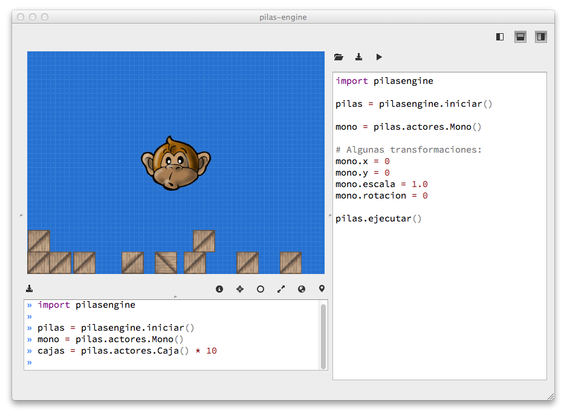

pilas-engine
============

 

Pilas es un motor para realizar videojuegos de manera rápida y sencilla.

Es una herramienta orientada a programadores casuales o principiantes, es ideal para quienes quieran aprender a realizar sus primeros videojuegos.

## ¿Cómo empezar?

Una buena forma de comenzar con pilas es instalar todo el kit de desarrollo siguiendo las intrucciones de nuestra web:

- http://www.pilas-engine.com.ar

Y una vez instalada la biblioteca, se puede invocar al comando ``pilas -e`` para ver una lista completa de ejemplos y minijuegos.

## ¡Convocamos a colaboradores!

Tenemos una página [en nuestro wiki](https://github.com/hugoruscitti/pilas/wiki/participar) con
todos los consejos para volverse colaborar del proyecto y participar en el desarrollo.

## Instalación

La forma mas sencilla de instalar pilas en mediante los instaladores
del sitio web:

- http://pilas-engine.com.ar/#/descargas

Los instaladores se generan pediodicamente y se distrubuyen para
los sistemas mas utilizados.

Si quieres instalar pilas-engine desde el código fuente, [visitá
la página del wiki que explica todo el proceso](https://github.com/hugoruscitti/pilas/wiki/instalacion)

## Tests

Nuestros tests se ejecutan en [travis](https://travis-ci.org/hugoruscitti/pilas), aunque
si quieres los puedes ejecutar manualmente en tu equipo con el siguiente comando:

    make utest

## Licencia

Pilas es software libre, y se distribuye bajo la licencia LGPLv3.

Visita nuestro sitio web para obtener mas detalles:

- http://www.pilas-engine.com.ar
