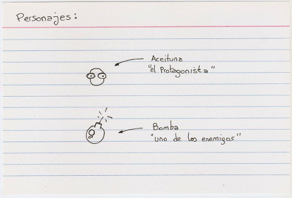
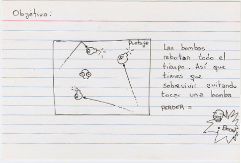
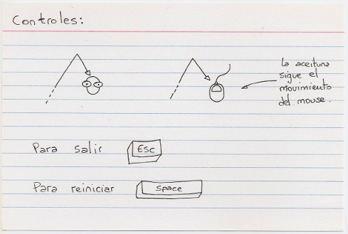
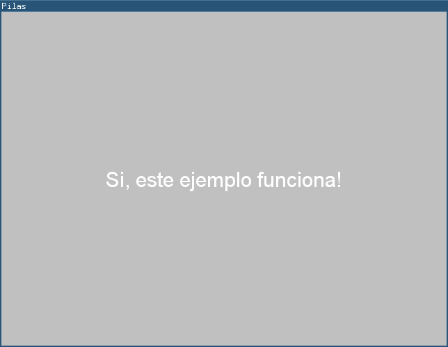
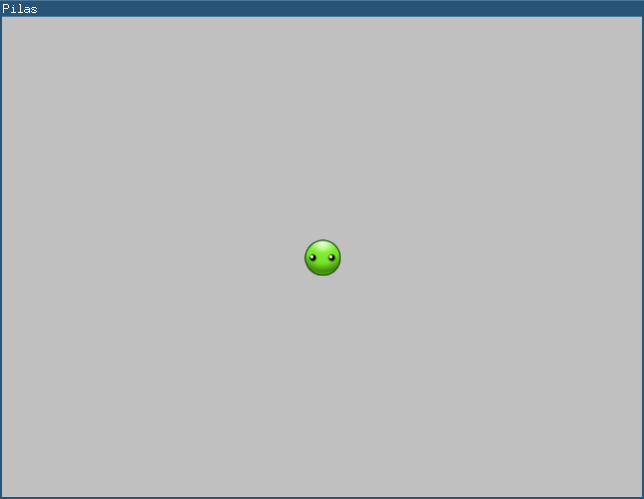
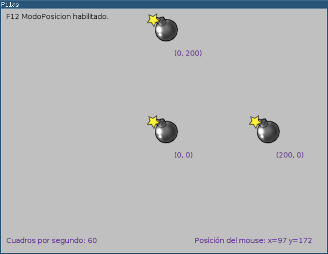

## Aceitunas vs Bombas, parte 1

El objetivo de este artículo es mostrar el proceso completo de
programación de un juego.

Usaremos el motor de videojuegos pilas, y desarrollaremos el código
paso a paso, haciendo pruebas y modificaciones en cada etapa para que
puedas observar las variantes.

Te invito a que leas este tutorial de manera práctica, no dudes en
comenzar a escribir los ejemplos de código y observa lo que ocurre
directamente en tu equipo.

### Herramientas

Para hacer un juego divertido y entretenido no hacen falta muchos
recursos, hay juegos simples con pocos elementos que hacen divertir a
muchas personas.

Así que nuestro juego tendrá ese objetivo, ser simple y
divertido. Nada más...

¿Y que herramientas podemos usar?, para comenzar utilizaremos
bocetos, la idea es tener una instancia en la que podemos imaginar "qué" tipo de
juego queremos y como se tiene que ver y jugar.

Luego vamos a comenzar a programar, con una herramienta como Aptana
(de la familia de eclipse) o con cualquier editor de texto.&nbsp;
Usaremos un proceso de desarrollo paso a paso, con una idea
semi-terminada del juego, pero animándonos a darle forma al juego
mientras lo escribimos.

Este proceso paso a paso es iterativo, y en mi experiencia es uno de
los mejores para hacer juegos, porque te permite descubrir y explorar a
mitad de camino, corregir el rumbo en caso de dificultades e incluso
divertirte con los resultados intermedios.

### La idea del juego

Vamos a hacer un juego muy simple: "aceituna vs bombas" será un
juego donde nuestro protagonista es una aceituna, y los enemigos son un
montón de bombas que se mueven de un lado a otro en la pantalla:

El objetivo del juego es sobrevivir la mayor cantidad de tiempo
evitando que las bombas toquen al enemigo:

El protagonista se tiene que mover con el mouse, y pierde al
instante que entra en contacto con una bomba...

Luego, para completar el juego, tenemos que agregar un menú con
opciones básicas, una guia de cómo jugar y contadores de tiempo en
pantalla:

- El personaje tiene una sola vida, y el puntaje cuenta solamente para el juego actual.
- Es decir, no vamos a guardar un ranking o algo así. Tal vez sí en el futuro...

### Creando el proyecto

Vamos a comenzar a crear nuestro juego, lo primero es crear el
proyecto de pilas.

Un proyecto en pilas es solamente un directorio con un archivo dentro.

Si estás dentro de un entorno de programación como aptana o ninja-ide
tienes que ir al menú file y crear un proyecto de python (en aptana lo
llaman pydev).

El archivo del proyecto puede tener un nombre como ejecutar.py

Y una buena idea para comenzar con pie derecho
es tener un poco de código y ejecutarlo para
corroborar que pilas funciona correctamente
en nuestro equipo:


import pilas

pilas.iniciar()
mensaje = pilas.actores.Texto("Si, este ejemplo funciona!")
pilas.ejecutar()


Ahora solo tenemos que pulsar CTRL+F11 (si estás en aptana), F3 si
estás en ninja-ide o escribir el comando python ejecutar.py en consola.

El resultado será así:

Veamos un poco el código. Todo programa realizado en pilas debe comenzar con una sentencia
cómo <tt class="docutils literal">import pilas</tt>.

Eso nos provee acceso al motor y a toda su funcionalidad.
La función <tt class="docutils literal">iniciar</tt>
nos permite abrir un ventana.  

Esta función acepta (opcionalmente) algunos argumentos como el tamaño de la ventana o el título, pero en nuestro caso solamente usaremos una ventana simple y corriente, así que no escribimos ningún argumento.
La linea <tt class="docutils literal">texto = pilas.actores...</tt> simplemente
genera el mensaje en pantalla.

Y por último, es muy importante que al hacer un juego con pilas invoques a la función <tt class="docutils literal">pilas.ejecutar()</tt>.
Esta función se encarga de mantener al juego en funcionamiento, mostrando la ventana y permitiendo que le usuario pueda interactuar con ella.

### El protagonista

Tomemos el código de antes, pero quitemos el mensaje de prueba y en su lugar pongamos al personaje del juego: una aceituna.


protagonista = pilas.actores.Aceituna()


Ahora, nos gustaría que el protagonista se pueda mover por el escenario con el movimiento del mouse. Para eso tenemos que enseñarle al actor una habilidad:


protagonista.aprender(pilas.habilitades.SeguirAlMouse)
pilas.mundo.motor.ocultarpunterodel_mouse()


Las habilidades te permite añadir comportamiento a los actores fácilmente. En el código anterior simplemente le decimos al actor que tiene que seguir al puntero del mouse.
Ten en cuenta que también hemos ocultado el puntero real del mouse, así podemos apreciar el rostro de la aceituna.
Bien, hora de ejecutar el programa. Pulsa CTRL+F11 o python ejecutar.py. Lo que se puede apreciar en la ventana es lo siguiente:

Adjuntos: <a href="codigos/paso1.py">paso1.py</a>

### Enemigos

Para crear los enemigos tenemos que hacer algo más completo. Los enemigos se tienen que poder mover por la pantalla con total autonomía.
Así que para abordar la creación de los enemigos vamos a ir por partes, poco a poco.

Comencemos creando 3 personajes sencillos sin movimiento:


bomba_1 = pilas.actores.Bomba()
bomba_2 = pilas.actores.Bomba(x=200, y=0)
bomba_3 = pilas.actores.Bomba(x=0, y=200)


Pon a funcionar el ejemplo y observarás que ahora tenemos las 3 bombas en pantalla, sin movimiento.

Ahora pulsa la tecla F12 en la ventana de pilas, se dibujarán en pantalla varios textos y coordenadas:

Esta funcionalidad se llama modo depuración, y es útil para observar con exactitud la posición de cada actor.

Ahora miremos un poco más de cerca, los números que están debajo de cada actor son las posiciones x e y. Por ejemplo, la bomba que hemos creado anteriormente como bomba_3 es la que aparece arriba.

Entonces, esto nos permite adelantar algo. Para que las bombas se puedan mover en pantalla tenemos que cambiar el valor de los atributos x e y progresivamente.

### Enemigos con movimiento

Para que las bombas tengan movimiento, una manera sencilla de mantener el código legible y fácil de mantener es crear una clase de actor nueva: una bomba con movimiento.

Entonces, nuestro código inicial dejará de usar sentencias cómo Bomba(.. y pasará a usar BombaConMovimiento(..

Crear una clase de actor consiste en tomar un clase de modelo (en este caso Bomba) y heredar de ella lo que nos interesa para crear una clase nueva.

Esto en python se escribe más o menos así:


from pilas.actores import Bomba

class BombaConMovimiento(Bomba):

    def __init__(self, x, y):
        Bomba.__init__(self, x, y)


Esta nueva clase hace exactamente lo mismo que una bomba normal, pero nos ofrece un poco más de posibilidades, podemos personalizarla por completo.

En nuestro caso queremos cambiar los valores de x y de y progresivamente, para simular movimiento, así que podemos agregarle a esta clase el método actualizar:


from pilas.actores import Bomba

class BombaConMovimiento(Bomba):

    def __init__(self, x=0, y=0):
        Bomba.__init__(self, x, y)

    def actualizar(self):
        self.x += 0.5
        self.y += 0.5

        if self.x > 320:
            self.x = -320

        if self.y > 240:
            self.y = -240



El método actualizar es especial: internamente pilas está en funcionamiento todo el tiempo, y una de sus tareas es llamar a los métodos actualizar de todos los actores que se ven en la pantalla.

Si tomamos un actor cualquiera, y le codificamos un método llamado actualizar, pilas va a llamar a ese método en cada instante.

Esto nos permite simular movimiento, porque en nuestro caso el método actualizar aumenta el valor de x y de y dando pasos muy pequeños. Y si ese valor se sale de la pantalla, simplemente lo regresa por el lado contrario.

Así, con nuestra nueva clase BombaConMovimiento, tenemos que cambiar la primer parte del programa donde inicializamos las bombas:


bomba_1 = BombaConMovimiento()
bomba_2 = BombaConMovimiento(x=200, y=0)
bomba_3 = BombaConMovimiento(x=0, y=200)


Ahora sí, este es un video de lo que tenemos hasta ahora: Una aceituna que se mueve con el movimiento del mouse y 3 bombas:

<iframe width="640" height="480" src="http://www.youtube.com/embed/Usyy3o1hm5g" frameborder="0" allowfullscreen></iframe>

Adjuntos: <a href="codigos/paso2.py">paso2.py</a>

### Resumen

En esta primer parte hemos visto lo mas elemental del desarrollo de juego, tener una idea clara del juego y ponerlo en práctica rápidamente es fundamental. Y por suerte, eso lo hemos logrado.

En la siguiente parte del tutorial vamos a mejorar la dinámica del juego y poner algunas explosiones!.

<a href='aceitunas_vs_bombas_parte_2.html'>Leer la segunda parte</a>

