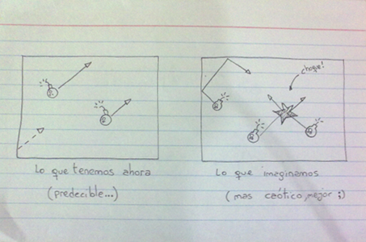
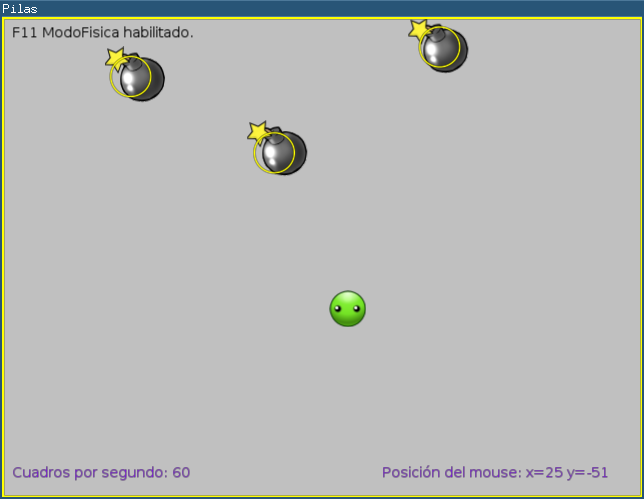
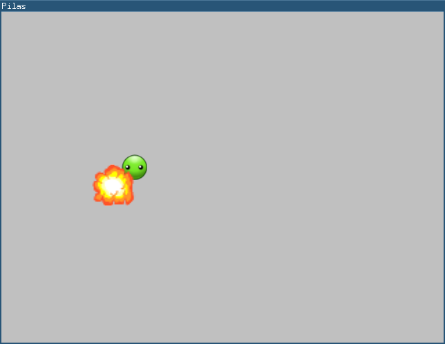

## Aceitunas vs Bombas, parte 2

### Repasando ...

Bien, hasta ahora tenemos un escenario con una aceituna que se mueve con el mouse y varias bombas en movimiento.

Con un poco de imaginación podrías empezar a jugar, las bombas no te van a lastimar, pero aún así notarás que se puede experimentar el modo de juego por completo.

¿Es divertido?, ¿si?, m.... yo creo que podría ser un poco mejor...

Hay algo en este jugo que no me gusta, el movimiento de las bombas es muy predecible, es demasiado fácil, con algo de práctica se hace muy fácil, cualquiera puede predecir a donde se van a mover las bombas...

Te propongo una solución, vamos a abordarlo desde la imaginación y luego desde ahí buscaremos ponerlo en marcha.

La propuesta es así: imagina cómo sería el juego si las bombas se pudieran mover por el escenario rebotando en las paredes y entre ellas.

La siguiente imagen nos puede servir como referencia para imaginar esta idea, a la izquierda tenemos un boceto de cómo es el juego ahora, las bombas se mueven en linea recta sin colisionar. Y a la derecha está la alternativa que imaginamos:

Entonces, ¿Que tal si elegimos implementar esa idea?, creo que será divertido, comencemos:

Pilas te facilita el desarrollo de juegos con un escenario como el que imaginamos, porque trae un módulo de física que implementa colisiones y movimientos muy realistas.

El primer paso es cambiar la llamada inicial a pilas, para indicarle que buscamos un escenario sin gravedad (como en el espacio).

En lugar de iniciar la biblioteca con:


pilas.iniciar()


Vamos a colocar un argumento adicional, gravedad:


pilas.iniciar(gravedad=(0, 0))


Luego, tenemos que cambiar la clase BombaConMovimiento, este es el nuevo código:


class BombaConMovimiento(Bomba):

    def __init__(self, x=0, y=0):
        Bomba.__init__(self, x, y)

        self.circulo = pilas.fisica.Circulo(x, y, 20, restitucion=1, friccion=0, amortiguacion=0)
        self.imitar(self.circulo)

        self._empujar()

    def _empujar(self):
        dx = 1
        dy = 1
        self.circulo.impulsar(dx * 10, dy * 10)


Observa lo que cambiamos aquí, nuestras bombas en realidad están compuestas por un círculo, que se empuja en una dirección determinada por dx y dy. Y ya no tenemos el método actualizar, ya no lo necesitamos, en lugar de alterar los atributos x e y, dejamos que la bomba imite el movimiento del círculo que creamos.

Pero, ¿Que es exactamente ese círculo?. El círculo que creamos desde el módulo pilas.fisica es invisible, pero cumple una función muy importante.

Pulsa la tecla F11 cuando el juego está en funcionamiento:

Los círculos de color amarillo son elementos del motor de física, responden a las colisiones, la aceleración gravitatoria del escenario, etc...

Ahora bien, ¿has intentado jugar?, yo sí, y creo que es un poco mas divertido y prometedor que antes, ahora las bombas rebotan como habíamos imaginado y el resultado es un poco mas caótico y desafiante.

Adjuntos: <a href="codigos/paso3.py">paso3.py</a>

### Explosiones

¿Y cómo se pierde?, simple, intuitivamente esperaríamos que el usuario esquive las bombas, pero que si la bomba los toca explote (y el juego termine).

Hagamos eso, digamos a pilas que haga explotar una bomba cuando se toque al protagonista:

Primero tenemos que cambiar el código de creación de las bombas, tenemos que agrupar a todos los enemigos en una lista:


bomba_1 = BombaConMovimiento()
bomba_2 = BombaConMovimiento(x=200, y=0)
bomba_3 = BombaConMovimiento(x=0, y=200)

lista_de_bombas = [bomba_1, bomba_2, bomba_3]


Luego, tenemos que escribir una función indicandole a pilas que vamos a hacer cuando se produzca la colisión. En nuestro caso vamos a tomar la bomba y hacerla explotar:


def cuando_colisionan(aceituna, bomba):
    bomba.explotar()


y por último, el código que asocia las tres cosas: el protagonista, las bombas y la función:


pilas.mundo.colisiones.agregar(protagonista, listadebombas, cuando_colisionan)


Listo, ahora tenemos explosiones, puedes poner en funcionamiento el juego y chocar a las bombas con el mouse, vas a ver como explotan las bombas y nuestro protagonista ileso...

Así nos quedaría en video:

<iframe width="640" height="480" src="http://www.youtube.com/embed/ZPe4ct2g99c" frameborder="0" allowfullscreen></iframe>

Adjuntos: <a href="codigos/paso4.py">paso4.py</a>

### Flexibilidad, una opinión personal...

Habrás notado que el proceso de desarrollo vamos cambiando partes del código, vamos tomando nuevas decisiones y alterando lo que tenemos sin remordimientos.

Esto está bien, de hecho, es una forma muy válida y recomendable de hacer software, escribir código flexible y fácil de adaptar a nuevas situaciones es una cualidad de software muy valorada.

En este tutorial adopté este enfoque de desarrollo, en principio porque me resulta mas divertido y fácil de presentar, pero principalmente porque creo que elimina esa barrera inicial de querer encontrar la mejora forma de hacer tal cosa, uno de los obstáculos mas peligrosos a la hora de hacer juegos.

Por eso, a esta altura del tutorial me animo a dar una opción personal: mi recomendación es que adoptes un modelo de desarrollo ágil y flexible como el que intento mostrar en este tutorial, hacer juegos es muy divertido, pero tienes que animarte a descartar, elaborar y rediseñar todo el tiempo...

### Haciendo algunas mejoras

Tener todo el código de nuestro juego en un solo archivo no es muy buena idea, porque es mucho mas simple cuando solo tienes que poner tu atención en una sola cosa y no en todo el código. Incluso, hay partes del juego que van a permanecer como ahora, nos gusta como quedaron (por ejemplo el movimiento del protagonista) y no vamos a modificarlas. Entonces, vamos a distribuir todo este código en distintos archivos.

A ese proceso de organización se lo llama modularización, porque intenta identificar partes re-utilizables del programa y desacoplarlos en archivos diferentes.

### Modularizando la clase BombaConMovimiento

Primero, vamos a tomar la clase BombaConMovimiento y llevarla a un archivo diferente, lo primero que tenemos que hacer es crear un archivo llamado bombaconmoviento.py y colocar el código de la clase:


import pilas
from pilas.actores import Bomba

class BombaConMovimiento(Bomba):

    def __init__(self, x=0, y=0):
        Bomba.__init__(self, x, y)

        self.circulo = pilas.fisica.Circulo(x, y, 20, restitucion=1, friccion=0, amortiguacion=0)
        self.imitar(self.circulo)

        self._empujar()

    def _empujar(self):
        dx = 1
        dy = 1
        self.circulo.impulsar(dx * 10, dy * 10)


Y luego, en nuestro archivo de código principal, ya no tendremos la clase directamente disponible, sino que tenemos que acceder a ella mediante un módulo (bombaconmoviento).

Tenemos que colocar la siguiente linea al principio del archivo:


import bombaconmovimiento


y luego, en lugar de iniciar los objetos BombaConMovimiento directamente desde su clase, tenemos que hacer referencia al módulo que los contiene:


bomba_1 = bombaconmovimiento.BombaConMovimiento()
bomba_2 = bombaconmovimiento.BombaConMovimiento(x=200, y=0)
bomba_3 = bombaconmovimiento.BombaConMovimiento(x=0, y=200)


Es decir, ahora la clase BombaConMovimiento solamente es accesible si indicamos correctamente el espacio de nombres al que pertenece. Esto nos ayuda a tener el código mejor distribuido.

¿Por qué es un buen cambio?, porque ahora podemos concentrarnos solamente en la porción de código que buscamos ver, no en todo el proyecto, lo que hace una diferencia grande cuando el proyecto empieza a crecer y comienza a tener mas funcionalidad y recursos.

### Modularizando al protagonista

El otro personaje del juego que podemos separar en un archivo diferente es el protagonista del juego, actualmente el código que genera al protagonista consiste en 3 sentencias de código:


protagonista = pilas.actores.Aceituna()
protagonista.aprender(pilas.habilidades.SeguirAlMouse)
pilas.mundo.motor.ocultar_puntero_del_mouse()


Ahora bien, sería mucho mas práctico que el personaje se pueda crear con una sola sentencia de código, porque efectivamente no queremos hacer esas tres cosas de manera aislada, crear el protagonista incluye crear una aceituna, que la aceituna siga al mouse y que se oculte el puntero del mouse... las tres cosas juntas, ni mas ni menos...

Entonces, hagamos algo parecido a lo que hicimos con la bomba, ahora el protagonista es una nueva clase llamada Aceituna y que vive en el módulo aceituna.py.

Veamos el nuevo código del archivo aceituna.py:


import pilas

class Aceituna(pilas.actores.Aceituna):
    def __init__(self):
        pilas.actores.Aceituna.__init__(self)
        self.aprender(pilas.habilidades.SeguirAlMouse)
        pilas.mundo.motor.ocultar_puntero_del_mouse()


Y el código inicial, que tenía 3 sentencias ahora se reduce a empezar con la sentencia:


import aceituna


y luego para crear al protagonista:


protagonista = aceituna.Aceituna()


Entonces, mediante desacomplamiento logramos distribuir un poco mejor nuestro juego.

Adjuntos: <a href="codigos/paso5.py">paso5.py</a>, <a href="codigos/aceituna.py">aceituna.py </a> y <a href="codigos/bombaconmovimiento.py">bombaconmovimiento.py</a>

### Resumen

En esta segunda parte mejoramos mucho la experiencia de juego, ahora los movimientos son menos predecibles, tenemos colisiones y el código mejor distribuido.

Esto nos deja paso a la parte 3, donde vamos a seguir haciendo mejoras y conociendo el concepto de escenas.

