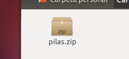
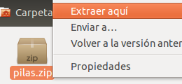



## Descargando ...

La descarga de pilas comenzará en unos segundos, sino, puedes descargarlo
nuevamente <a href='{{ download_url }}'>desde aquí</a>.

<iframe src="{{ download_url }}" style="display: none"></iframe>

Te sugerimos estos pasos a seguir

  

    </img>
     
    Ubica el archivo descargado.
  

  

    </img>
     
    Abre el archivo con tu descrompresor favorito.
  

  

    </img>
     
    Comienza abriendo en archivo README.md
  

