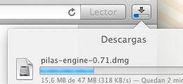
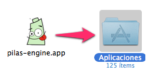



## Descargando ...

La descarga de pilas comenzará en unos segundos, sino, puedes descargarlo
nuevamente <a href='{{ download_url }}'>desde aquí</a>.

<iframe src="{{ download_url }}" style="display: none"></iframe>

Te sugerimos estos pasos a seguir

  

    </img>
     
    Guardar y luego abrir el instalador.
  

  

    </img>
     
    Mover pilas sobre Aplicaciones.
  

  

    </img>
     
    Abrir pilas desde Launchpad.
  

