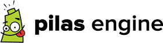

Guía de referencia
==================

Pilas es un motor de videojuegos sencillo, escrito en python
y orientado a principiantes.

Iniciar
-------

Para empezar puedes escribir ``import pilas``, y luego usar alguna
de las siguientes funciones:

iniciar(ancho, alto, titulo, usar_motor, gravedad)
    inicia la biblioteca y la ventana principal. Todos los argumentos son opcionales, los valores de ``usar_motor`` pueden ser 'qt' o 'qtgl'.
pilas.terminar()
    para cerrar la ventana (su atajo es la tecla 'alt+q')
pilas.ejecutar()
    para poner en funcionamiento la biblioteca desde script, no hace falta llamarla en modo interactivo.
pilas.avisar(mensaje)
    dibuja un mensaje al pie de la ventana.
pilas.ver(objeto)
    muestra el codigo de un objeto o modulo.

Uso básico de Actores
---------------------

Los actores te permiten representar personajes con facilidad.

Para crear un actor tienes que escribir algo cómo:

.. code-block:: python

    mono = pilas.actores.Mono()

cada actor tiene atributos cómo: x, y, z, rotacion, escala, espejado, centro.

Por ejemplo:

.. code-block:: python

    mono.escala = 2
    mono.x = 200

Y como cada actor es un objeto, también entienden
mensajes cómo:

.. code-block:: python

    mono.sonreir()
    mono.decir("Hola!")

usa el comando ``help(mono)`` para conocer mas de
este actor, o bien ``pilas.ver(mono)``.

Los atributos también pueden recibir listas para
realizar animaciones, por ejemplo, esta sentencia
duplica el tamaño del actor en 5 segundos:

.. code-block:: python

    mono.escala = [2], 5

Otros actores
-------------

Mono, Pelota, Caja, Bomba, Tortuga, Banana, Pingu, Animacion ... 

Atajos de teclado
-----------------

La pantalla principal de pilas tiene algunos atajos útiles:

    **F7**  Ver información de sistema

    **F8**  Ver puntos de control (centros)

    **F9**  Ver radios de colisión

    **F10**  Ver áreas de imágenes originales.

    **F11**  Ver figuras físicas.

    **F12**  Ver posiciones.

Movimientos
-----------

Para simular movimientos puedes usar la función ``interpolar`` o simplemente
asignar listas:

pilas.interpolar(valor_o_valores, duracion=1, demora=0, tipo='lineal')
    busca todos los valores intermedios entre los valores que se le indican
    como parámetro y el atributo que recibirá modificaciones.

Por ejemplo:

.. code-block:: python
    
    mono.rotacion = pilas.interpolar(360)
    mono.x = pilas.interpolar([-200, 200, 0], duracion=2)
    mono.y = [200, 0]

Habilidades
-----------

Las habilidades permite dotar a los actores de características
que le permite interactuar con el usuario.

Algunas habilidades son:

- SeguirAlMouse
- AumentarConRueda
- SeguirClicks
- Arrastrable
- MoverseConElTeclado
- RebotarComoPelota
- RebotarComoCaja
- etc...

y se pueden anexar a los actores así:

.. code-block:: python

    mono.aprender(pilas.habilidades.RebotarComoPelota)
    mono.aprender(pilas.habilidades.Arrastrable)

Colisiones
----------

Primero tienes que hacer la función de respuesta a la colisión:

.. code-block:: python

    def toca_bomba(mono, bomba):
        mono.gritar()
        bomba.explotar()

y luego crear los actores en una lista y asociarlos al
sistema de colisiones:

.. code-block:: python

    mono = pilas.actores.Mono()
    bomba = pilas.actores.Bomba()

    bombas = bomba * 10

    pilas.colisiones.agregar(mono, bombas, toca_bomba)

Referencias
-----------

 * http://www.pilas-engine.com.ar
 * http://www.losersjuegos.com.ar
