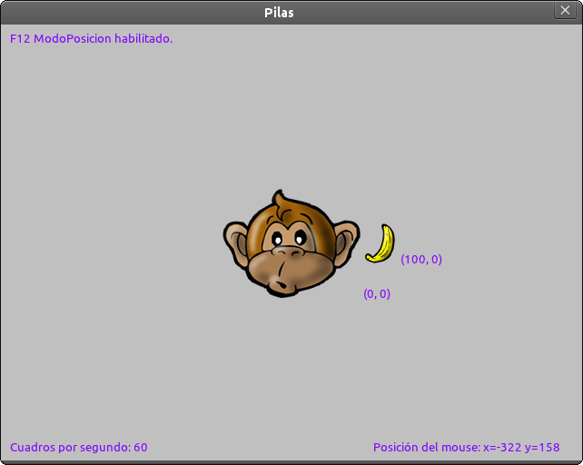
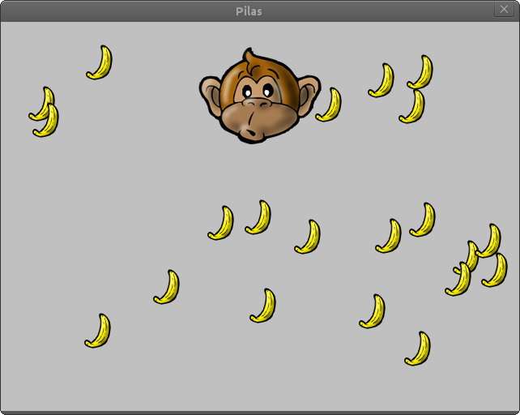

Colisiones
==========

Las colisiones entre actores son muy simples, porque
cada actor tiene un atributo llamado ``radio_de_colision``
que le permite entrar en contacto con otros.

Un ejemplo sencillo
-------------------

Comencemos con un ejemplo, coloque dos actores
en la pantalla de su juego:

.. code-block:: python

    banana = pilas.actores.Banana()
    banana.x = 100
    mono = pilas.actores.Mono()

Ahora pulse F12 para ver el área de colisión de cada
actor.

El círculo de color verde indica cual es el area de colisión, y
se puede cambiar si queremos con una sentencia cómo:

.. code-block:: python

    banana.radio_de_colision = 30

Ahora, para poder mover al mono podemos enseñarle
una habilidad:

.. code-block:: python

    mono.aprender(pilas.habilidades.Arrastrable)

Ahora vamos a crear una función con lo que queremos
que hagan los dos actores al entrar en contacto:

.. code-block:: python

    def el_mono_come(mono, banana):
        mono.sonreir()
        banana.eliminar()

y por último crear dos listas de actores y decirle
a pilas que asocie la función de mas arriba con
la colisión:

.. code-block:: python

    bananas = [banana]
    pilas.colisiones.agregar(mono, bananas, el_mono_come)

Perfecto, ahora si mueves al mono por la pantalla con el
mouse podrá comer bananas.

Intenta crear mas actores que representen bananas y
agregarlos a la lista que usamos antes, por ejemplo:

.. code-block:: python

    b = pilas.actores.Banana()
    b.x = -100

    bananas.append(b)

Ahora intenta nuevamente mover al mono... sí, las colisiones
seguirán funcionando, cualquier objeto que agregues a la lista
de bananas será alimento del mono...

Bien, ¿y si queremos llenar la pantalla de comida?, una forma
sencilla es ejecutar lo siguiente:

.. code-block:: python

    import random
    cantidad_de_bananas = 20

    for i in range(cantidad_de_bananas):
        banana = pilas.actores.Banana()
        banana.x = random.randrange(-200, +200)
        banana.y = random.randrange(-200, +200)
        bananas.append(banana)

La pantalla se llenará de bananas, bah, habrá exactamente 20...

