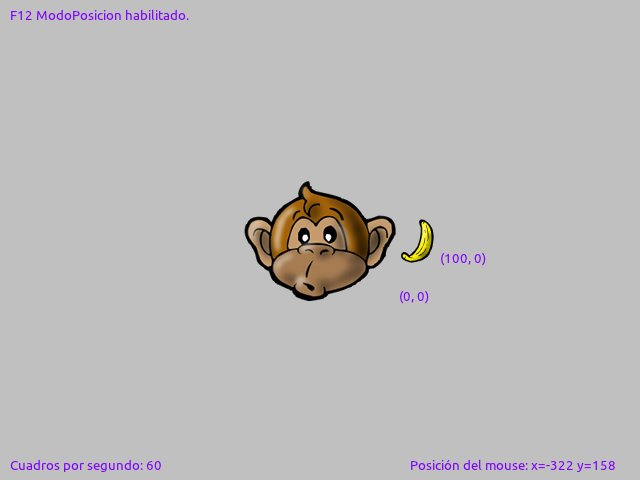
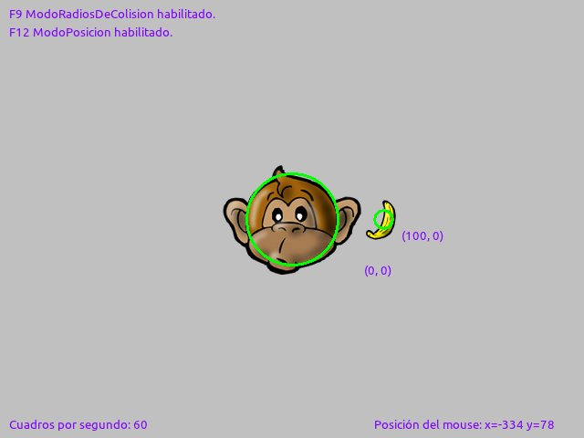
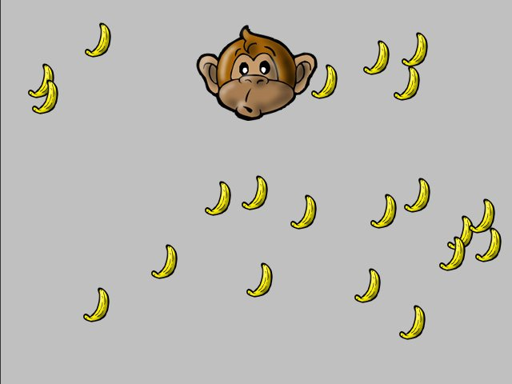

Colisiones
==========

En el desarrollo de videojuegos le damos el
nombre de ``colisión`` a lo que ocurre cuando
dos actores entran en contacto.

Por ejemplo, cuando un personaje como ``Pacman`` toca
a un ``Fantasma`` se produce una colisión.

Para programar colisiones en pilas tienes seguir
unos pocos pasos.

- Tienes que pensar "qué" quieres hacer cuando se produce una colisión.
- Escribir una función de respuesta a la colisión.
- y, por último, decirle a pilas qué actores son colisionables entre sí.

Ten en cuenta que cada actor tiene un atributo llamado
``radio_de_colision``, que se representa como un círculo de color
verde cuando pulsas la tecla F12 sobre la ventana.

Un ejemplo sencillo
-------------------

Comencemos con un ejemplo, coloque dos actores
en la pantalla de su juego:

.. code-block:: python

    banana = pilas.actores.Banana()
    banana.x = 100
    mono = pilas.actores.Mono()

Ahora pulsá la tecla **F12** para ver la posición de cada
uno de los actores:

Si pulsas **F9**, aparecerá un circulo verde por cada actor. Ese
círculo indica el radio de colisión de cada actor:

Este círculo se puede alterar cambiando el valor del ``radio_de_colision``
del actor:

.. code-block:: python

    banana.radio_de_colision = 30

.. image:: images/radios.png

Ahora, para poder mover al mono, podemos enseñarle
una habilidad:

.. code-block:: python

    mono.aprender(pilas.habilidades.Arrastrable)

Ahora vamos a crear una función con lo que queremos
que hagan los dos actores al entrar en contacto:

.. code-block:: python

    def el_mono_come(mono, banana):
        mono.sonreir()
        banana.eliminar()

y por último crear dos listas de actores y decirle
a pilas que asocie la función de mas arriba con
la colisión:

.. code-block:: python

    bananas = [banana]
    pilas.escena_actual().colisiones.agregar(mono, bananas, el_mono_come)

Perfecto. Ahora, si mueves al mono por la pantalla con el
mouse, podrá comer bananas.

Intenta crear mas actores que representen bananas y
agregarlos a la lista que usamos antes, por ejemplo:

.. code-block:: python

    b = pilas.actores.Banana()
    b.x = -100

    bananas.append(b)

Ahora intenta nuevamente mover al mono... sí, las colisiones
seguirán funcionando, cualquier objeto que agregues a la lista
de bananas será alimento del mono...

Bien, ¿y si queremos llenar la pantalla de comida?, una forma
sencilla es ejecutar lo siguiente:

.. code-block:: python

    bananas += pilas.atajos.fabricar(pilas.actores.Banana, 20)

La pantalla se llenará de bananas, bah, habrá exactamente 20...

De hecho, si quieres tener mas control sobre las bananas
que se crearán, puedes usar esta rutina de código
en lugar de llamar a la función ``fabricar``:

.. code-block:: python

    import random
    cantidad_de_bananas = 20

    for i in range(cantidad_de_bananas):
        banana = pilas.actores.Banana()
        banana.x = random.randrange(-200, +200)
        banana.y = random.randrange(-200, +200)
        bananas.append(banana)
