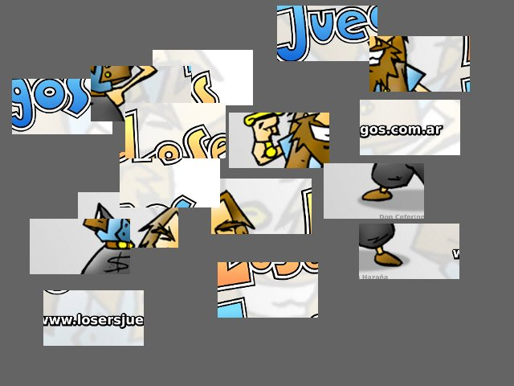
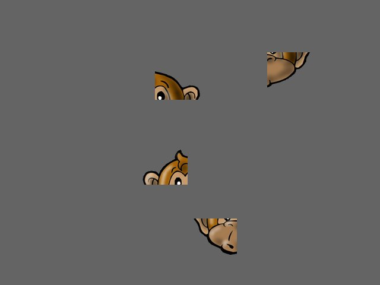
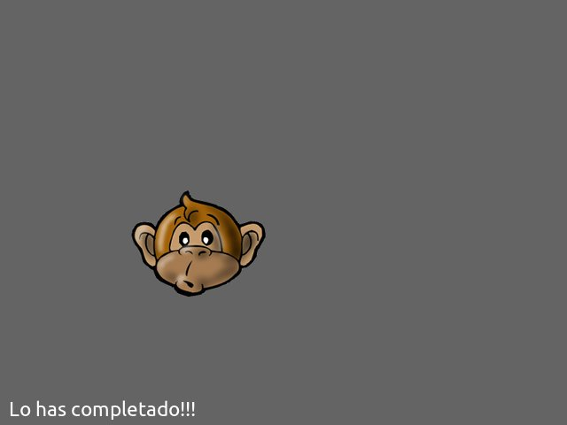

Demos
=====

Pilas viene con un módulo de ejemplos muy sencillos
para que puedas investigar y jugar.

Este módulo de ejemplos es ``pilas.demos`` y está
organizado como un conjunto de clases sencillas.

Para poner en funcionamiento alguna de las demos
simplemente tienes que hacer un objeto a partir
de alguna de las clases que verás en el módulo y ejecutar su método 'iniciar()'.

Piezas
------

Hay un pequeño rompecabezas que se puede iniciar con el siguiente código:

.. code-block:: python

    import pilas
    
    pilas.iniciar()
    piezas = pilas.demos.piezas.Piezas()
    piezas.iniciar()
    
    pilas.ejecutar() # Necesario al ejecutar en scripts.

inmeditamente despúes de evaluar estas sentencias, aparecerá en
pantalla un grupo de piezas para que puedas 
empezar a acomodarlas usando el mouse.

Ten en cuenta que los ejemplos también reciben parámetros, así
podemos alterar un poco mas el funcionamiento del minijuego.

Veamos cómo podemos crear un rompecabezas distinto a partir
del ejemplo ``Piezas``.

Escribe lo siguiente:

.. code-block:: python

    import pilas
    
    pilas.iniciar()
    piezas = pilas.demos.piezas.Piezas("mono.png", 2, 2)
    piezas.iniciar()
    
    pilas.ejecutar() # Necesario al ejecutar en scripts.

Si, ahora en pantalla aparece la imagen del mono pero separado
en 4 piezas. Dado que hemos especificado 2 (filas) y 2 (columnas).

Puedes usar cualquier imagen que quieras para construir tu
ejemplo de piezas.

También se admite una función cómo argumento al
crear el objeto, que se invocará cuando el usuario
complete el rompecabezas:

.. code-block:: python

    import pilas
    
    pilas.iniciar()
    
    def cuando_se_complete():
        pilas.avisar("Lo has completado!!!")
    
    piezas = pilas.demos.piezas.Piezas("mono.png", 2, 2, cuando_se_complete)
    piezas.iniciar()
    
    pilas.ejecutar() # Necesario al ejecutar en scripts.

