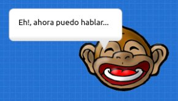
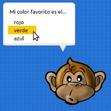

========
Diálogos
========

Para contar una historia dentro de un juego
podrías hacer que los personajes conversen
entre sí.

Esto es muy habitual en un genero de videojuego
llamado aventuras gráficas.

Mensajes de dialogo
-------------------

Para hacer que un personaje emita un mensaje sencillo
puedes usar el método ``decir``:

.. code-block:: python

    actor = pilas.actores.Mono()
    actor.decir("Eh!, ahora puedo hablar...")

Esto hará que el personaje muestre un globo similar al
de las historietas con las frases que has colocado.

Conversaciones
--------------

Los mensajes de dialogo se pueden usar para que dos
o mas actores puedan conversar entre sí. Esto es útil
para contar una historia, ya que le permites al usuario
ir viendo paso a paso lo que se dicen los actores entre
sí.

Para crear una conversación entre actores tienes que
crear un objeto de la clase ``Dialogo``, luego
indicarle la secuencia de conversación y por último
iniciar el dialogo:

.. code-block:: python

    dialogo = pilas.actores.Dialogo()

    dialogo.decir(mono, "Hola, como estas?")
    dialogo.decir(otro_mono, "Perfecto!!, gracias...")
    dialogo.decir(mono, "genial...")

    dialogo.iniciar()

Ahora cuando ejecutes este programa, solamente aparecerá
el primer mensaje ``"Hola, cómo estas?"`` y solo cuando el
usuario haga click con el mouse avanzará.

Ten en cuenta que el método ``decir`` funciona como una
cola de mensajes, es decir, si llamas a ``decir`` el mensaje
no aparecerá inmediatamente. El mensaje aparecerá cuando
corresponda según el orden de la conversación que se siga.

Si quieres que un botón accione un mensaje y lo haga
de manera inmediata tendrías que usar un método cómo ``dialogo.decir_inmediatamente``.

Preguntas
---------

Para desarrollar conversaciones con preguntas también
puedes usar a los diálogos. Lo único diferente es que las 
preguntas traerán asociada una repuesta del usuario, y para
manejar el resultado tienes que escribir una función.

La función se invocará cuando el usuario haga click en
alguna de las opciones. Y cuando se llame la función
se pasará la respuesta que ha elegido como una cadena
de texto.

Aquí tienes una ejemplo de una pregunta con 3 respuestas. Cuando
el usuario elija una repuesta el personaje volverá a
decirlo:

.. code-block:: python

    def cuando_responde_color_favorito(respuesta):
        dialogo.decir(mono, "he dicho: " + respuesta)

    dialogo.elegir(mono, "Mi color favorito es el...", ["rojo", "verde", "azul"], cuando_responde_color_favorito)       

