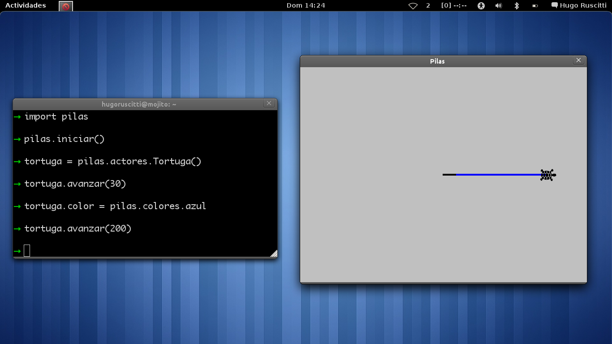
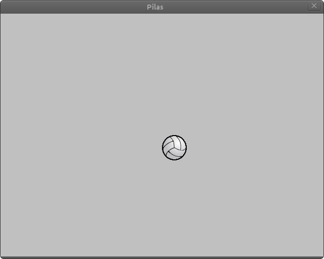
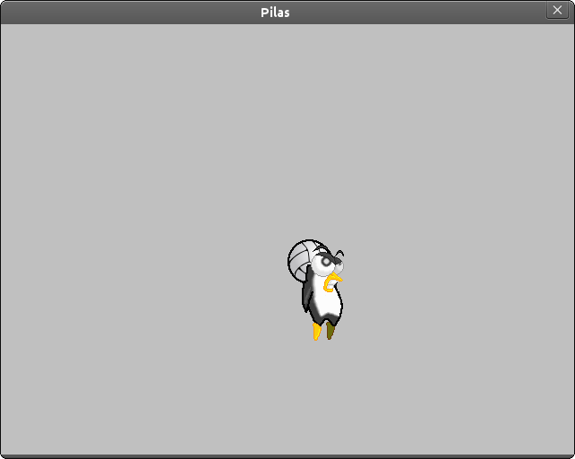

Dibujando en pantalla
=====================

Pilas te permite dibujar figuras en la ventana
de muchas formas. En esta sección veremos las
posibilidades de ofrece pilas para dibujar
de la manera mas sencilla, mientras que la
sección que sigue cubre el dibujo mas avanzado.

Usando la Tortuga
=================

El actor ``Tortuga`` está inspirado en una de
las actividades mas divertidas, didácticas y simbólicas
del lenguaje de programación **logo**, creado
por Seymour Papert.

La ``Tortuga`` básicamente es un actor que sabe
dibujar sobre la ventana de pilas. Para ello el
programador tiene que indicarle a la tortuga qué
movimiento tiene que hacer.

La siguiente imagen muestra lo que podría
dibujar la tortuga con algunas sentencias de
movimientos:

La imagen no alcanza a mostrar por completo el
concepto, pero en pocas palabras se puede ayudar
a imaginar cómo funciona realmente.

El dibujo de la imagen anterior es una traza que
va dibujando la tortuga a partir de su movimiento.

El siguiente código es el que se utilizó para
dibujar esa figura:

.. code-block:: python

    tortuga = pilas.actores.Tortuga()

    for x in range(36):
        tortuga.avanzar(5)
        tortuga.giraizquierda(10)

    tortuga.color = pilas.colores.verde
    tortuga.avanzar(200)

Algo muy valioso en términos didácticos, es que
uno podría animarse a realizar dibujos simples cómo
una casa, un hexágono o un número diseñando una estrategía
de movimiento para la tortuga.

Inspeccionando a la tortuga
---------------------------

Para manejar a este actor tienes varios comandos
inspirados en logo.

Esta es una lista de los comandos mas utilizados:

+------------------+--------------+--------------------------------------+------------------------------------------------+
| Método completo  | nombre corto | ejemplo                              | ¿que hace?                                     |
+==================+==============+======================================+================================================+
| avanzar          | av           | tortuga.av(10)                       | avanza en dirección a donde mira la tortuga.   |
+------------------+--------------+--------------------------------------+------------------------------------------------+
| giraderecha      | gd           | tortuga.gd(45)                       | gira hacia la derecha los grados indicados.    |
+------------------+--------------+--------------------------------------+------------------------------------------------+
| giraizquierda    | gi           | tortuga.gi(45)                       | gira hacia la izquierda los grados indicados.  |
+------------------+--------------+--------------------------------------+------------------------------------------------+
| subelapiz        | sl           | tortuga.sl()                         | deja de dibujar cuando se mueve la tortuga.    |
+------------------+--------------+--------------------------------------+------------------------------------------------+
| bajalapiz        | bl           | tortuga.bl()                         | comienza a dibujar cuando la tortuga se mueve. |
+------------------+--------------+--------------------------------------+------------------------------------------------+
| pon_color        | pc           | tortuga.pc(pilas.colores.rojo)       | dibuja con el color indicado.                  |
+------------------+--------------+--------------------------------------+------------------------------------------------+
| pintar           | <<no tiene>> | tortuga.pintar(pilas.colores.blanco) | pinta toda la pantala del mismo color.         |
+------------------+--------------+--------------------------------------+------------------------------------------------+

Por supuesto hay algunos mas, pero esos quedan para
investigar en la clase propiamente dicha. Recuerda que
el auto-completado del intérprete de python es bastante
útil para estas cosas.

Usando una Pizarra
==================

Si quieres dibujar sobre la pantalla pero
de forma inmediata y con algunas posibilidades mas
elaboradas puedes
usar un actor llamado ``Pizarra``. Esta no es la
forma mas avanzada, pero es el siguiente paso después
de dominar al actor ``Tortuga``.

Este actor ``Pizarra`` es cómo un lienzo invisible sobre
el que podemos pintar imágenes, figuras
geométricas y trazos de cualquier tipo.

Comencemos con algo sencillo: para crear la pizarra y
dibujar un punto en el centro de la
pantalla se puede usar el siguiente
código:

.. code-block:: python

    pizarra = pilas.actores.Pizarra()
    pizarra.dibujar_punto(0, 0)

Dibujando usando lapices
------------------------

La pizarra tiene un componente interno que se
parece a un lápiz de color. Este lápiz
lo utilizaremos para dibujar sobre la
pizarra.

Este código es un ejemplo que imprime sobre
la pizarra una linea de color negro en diagonal:

.. code-block:: python

    pizarra = pilas.actores.Pizarra()
    pizarra.bajar_lapiz()
    pizarra.mover_lapiz(100, 0)
    pizarra.mover_lapiz(100, 100)
    pizarra.mover_lapiz(0, 0)

Así se verá:

.. image:: images/pizarra_dibuja_triangulo.png

De hecho, ahora que tienes el triangulo puedes
pulsar la tecla F12 y observar con mas claridad
dónde están situadas las puntas del triangulo:

.. image:: images/pizarra_dibuja_triangulo_modo_depuracion.png

Pintando imágenes
-----------------

Las pizarras también pueden dibujar imágenes sobre la superficie,
y esto es útil cuando quieras crear pinceles especiales sobre
la pizarra o construir un escenario usando bloques tipo
ladrillos.

Para pintar una imagen solo tienes que cargarla e
indicarla a la pizarra que la dibuje.

.. code-block:: python

    imagen = pilas.imagenes.cargar("pelota.png")
    pizarra.pintar_imagen(imagen, 0, 0)

Así se verá:

Ten en cuenta que la coordenada de la imagen es un poco
diferente a las coordenadas que vimos antes, cuando pintas
una imagen sobre una pizarra las coordenadas se dicen coordenadas
de pantalla. Eso significa que la posición (0, 0) es la esquina
superior izquierda. Los valores positivos de "x" son hacia la derecha
y los valores positivos de "y" van hacia abajo.

Pintando grillas de imágenes
----------------------------

De manera similar a las imágenes normales, sobre las pizarras
también se pueden pintar grillas.

Solamente tenemos que crear la grilla, seleccionar el
cuadro de animación y después decirle a la pizarra
que pinte el cuadro actual de la grilla:

.. code-block:: python

    grilla = pilas.imagenes.Grilla("pingu.png", 10)
    pizarra.pintar_grilla(grilla, 0, 0)

    grilla.definir_cuadro(2)
    pizarra.pintar_grilla(grilla, 100, 100)

    grilla.definir_cuadro(3)
    pizarra.pintar_grilla(grilla, 200, 200)

Así se verá:

Esto es útil cuando se quieren pintar bloques de un escenario
completo, por ejemplo podríamos tener una grilla con distintos
tipos de suelos (pasto, piedra, tierra) y luego ir
imprimiendo sobre una pizarra para formar un escenario completo.

Ten en cuenta que al igual que la impresión de imágenes, aquí también
las coordenadas se comportan un poco distinto, tienes que
usar coordenadas de pantalla. Observa la sección anterior
para tener mas detalle de las coordenadas de pantalla.

La pizarra como actor
---------------------

Recuerda que la pizarra también es un actor, así que puedes enseñarle
habilidades, cambiar su posición, rotación o lo que quieras.
