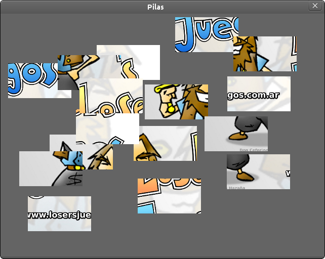
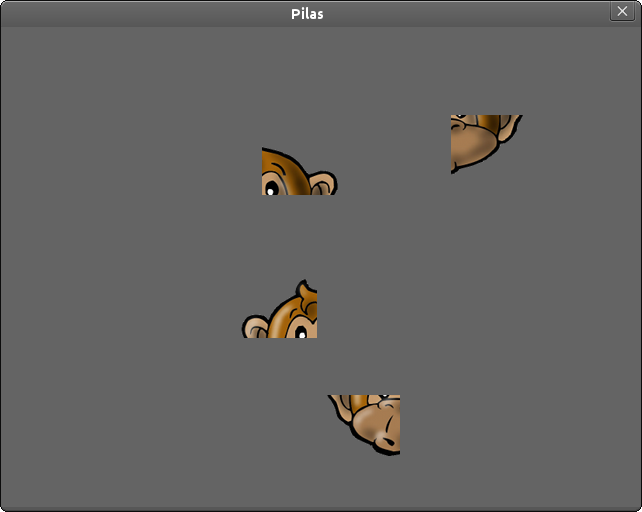

Ejemplos
========

Pilas viene con un módulo de ejemplos muy sencillos
para que puedas investigar y jugar.

Este módulo de ejemplos es ``pilas.ejemplos`` y está
organizado como una colección de clases.

Piezas
------

Hay hay un pequeño rompecabezas que se puede
iniciar con la siguiente sentencia:

.. code-block:: python

    pilas.ejemplos.Piezas()

inmeditamente despúes de evaluar esa sentencia, aparecerá en
pantalla un grupo de piezas para que puedas 
empezar a acomodarlas usando el mouse.

Ten en cuenta que los ejemplos también reciben parámetros, así
podemos alterar un poco mas el funcionamiento del minijuego.

Veamos cómo podemos crear un rompecabezas distinto a partir
del ejemplo ``Piezas``.

Escribe lo siguiente:

.. code-block:: python

    pilas.ejemplos.Piezas("monkey_normal.png", 2, 2)

Si, ahora en pantalla aparece la imagen del mono pero separado
en 4 piezas. Dado que hemos especificado 2 (filas) y 2 (columnas).

