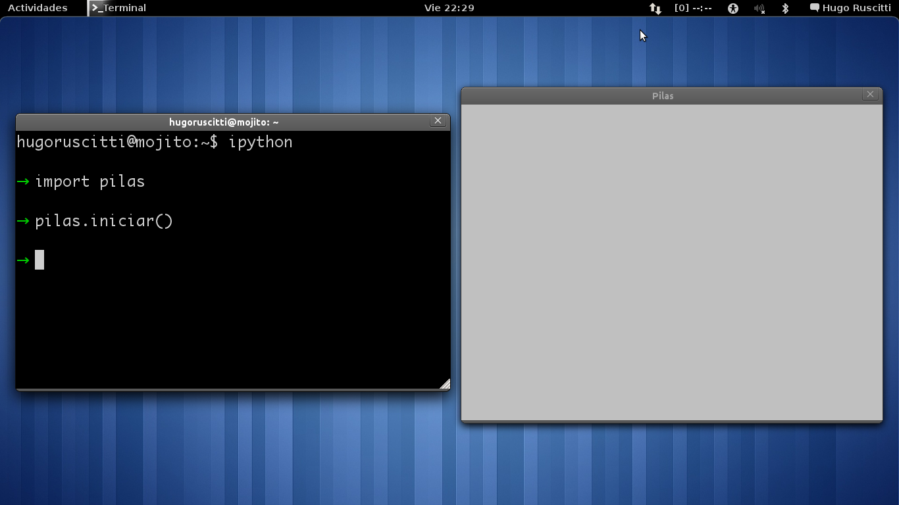
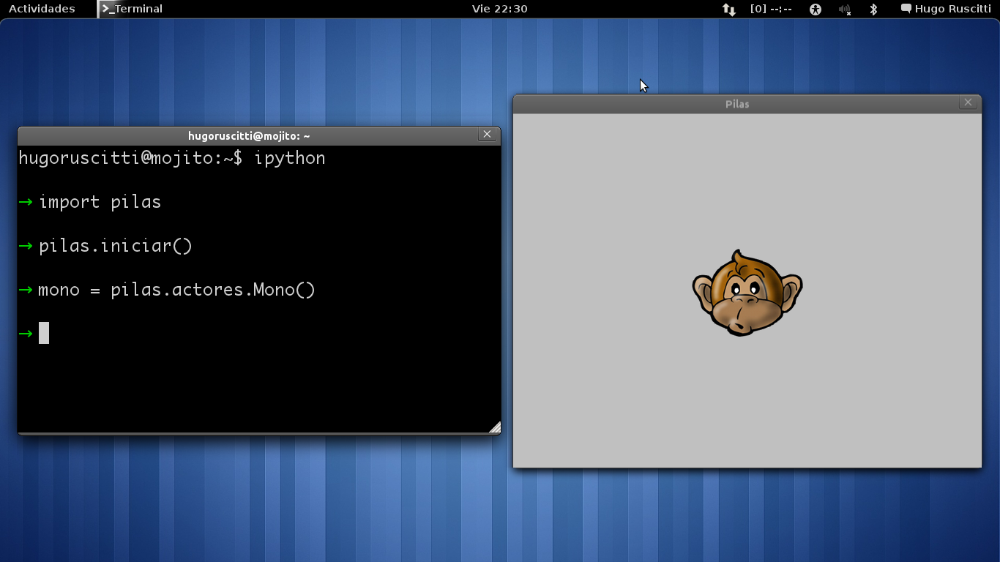

Empezando, la primer prueba
===========================

Si ya tienes instalada la biblioteca podemos
comenzar a realizar nuestras primeras pruebas.

Para empezar, pilas se puede usar directamente
desde un intérprete interactivo de python.

Mi recomendación personal es que utilices una
herramienta como IDLE, que te permite escribir
código de python y autocompletar el nombre
de las funciones. Aunque si
quieres puedes usar el intérprete estándar
de python, abriendo un terminal de texto y
ejecutando el comando ``python``.

Iniciando la biblioteca
-----------------------

Una vez dentro del intérprete, tienes
que escribir estas dos lineas de código:

.. code-block:: python

    import pilas
    pilas.iniciar()

En tu pantalla tiene que aparecer una ventana
de color gris:

Esa pantalla será la que utilizaremos para interactuar
con el motor. Y mas adelante será la única pantalla
que verán los usuarios de nuestros juegos.

A partir de ahora comenzaremos a escribir algunos
ejemplos. Ten en cuenta que no es necesario que
escribas todo el código de los ejemplos, el intérprete de python
te permite autocompletar sentencias usando la tecla ``Tab``. 

Creando al primer personaje
---------------------------

Un concepto importante en :mod:`pilas` es del de ``actores``. Un
actor en pilas es un objeto que aparece en pantalla, tiene
una posición determinada y se puede manipular.

Por ejemplo, una nave, un enemigo, una medalla... etc.

Para agilizar el desarrollo de juegos se incluyen varios
actores dentro del motor, un de ellos es ``Mono``, un
simpático chimpancé.

Escriba la siguiente sentencia dentro del intérprete de
python:

.. code-block:: python

    mono = pilas.actores.Mono()

En pantalla aparecerá un simpático personaje de color marrón:

Adoptaremos a este personaje dentro de nuestro juego
bajo un nombre, en este caso ``mono``. Así que para indicarle
acciones solo tenemos que utilizar su nombre y sentencias
simples.

Por ejemplo, para que el personaje cambie su expresión
fácil podemos usar sentencias cómo:

.. code-block:: python

    mono.sonreir()

o:

.. code-block:: python

    mono.gritar()

En cualquiera de los dos casos el personaje
cambiará su aspecto y emitirá un sonido.

.. image:: images/mono/smile.png
    :width: 5cm

Cosas en común para los actores
-------------------------------

Internamente, ``Mono`` es un actor, así que encontraremos
mucha funcionalidad en él que la tendrán el resto de los
actores.

Veamos algunas de estas características:

- Podemos cambiar la posición de un actor mediante las propiedades ``x`` e ``y``:

.. code-block:: python

    mono.x = 100
    mono.y = 100

Ten en cuenta que ``x`` e ``y`` son las coordenadas de posición
en el escenario. Por lo tanto el punto (0, 0) es el centro
de la ventana. Y ``x`` aumenta hacia la derecha e ``y`` hacia arriba.

.. image:: images/mono/normal.png
    :width: 5cm

- Todo actor tiene un atributo para indicar su tamaño en pantalla, el atributo ``escala`` (que originalmente vale 1):

.. code-block:: python

    mono.escala = 2

- También contamos con un atributo que indica la rotación en ángulos que debe tener el actor en pantalla. El atributo ``rotacion``:

.. code-block:: python

    mono.rotacion = 40

o bien:

.. code-block:: python

    mono.rotacion = 80

.. image:: images/mono/rotation80.png
    :width: 5cm

incluso puedes hacer un pequeña animación de rotación
completa con el siguiente código:

.. code-block:: python

    mono.rotacion = [360]

¿por qué?, porque los caracteres ``[`` y ``]`` representan
una lista de valores, y cuando pilas ve esta lista asignada
a un atributo de pilas intenta hacer una animación.

Veamos otro ejemplo, si queremos que un personaje
como el mono se mueva horizontalmente con una animación
podemos escribir esto:

.. code-block:: python

    mono.x = [-200, 200]

Pidiendo ayuda
--------------

Recuerda que cada componente de :mod:`pilas` está documentado
como un módulo de python. Por lo tanto puedes
ejecutar una sentencia cómo:

.. code-block:: python

    help(mono)

y aparecerán en pantalla todos los instructivos de
la funcionalidad del actor.

Incluso puedes usar la función ``pilas.ver`` para conocer
el código fuente de cualquier cosa de pilas. Por ejemplo
podemos el código completo del mono ejecutando
la sentencia:

.. code-block:: python

    pilas.ver(mono)

Eliminando a un actor
---------------------

Para eliminar un actor de la escena tienes que llamar
al método ``eliminar``:

.. code-block:: python

    mono.eliminar()

Conclusión
----------

Hemos visto los pasos principales para gestionar
actores. Ten en cuenta que el módulo :mod:``pilas.actores`` es
donde se guardarán todos los actores.

Un buen ejercicio es ponerse a investigar el módulo
actores. Hay muchos actores, estos son algunos ejemplos
de código para probar:

.. code-block:: python

    b = pilas.actores.Bomba()
    b.explotar()

    p = pilas.actores.Pingu()    # se mueve con el teclado.

Es todo por ahora, a divertirse!
