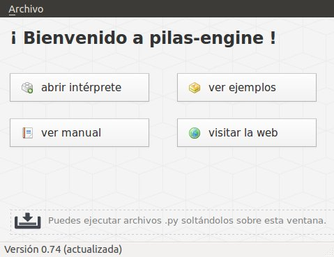
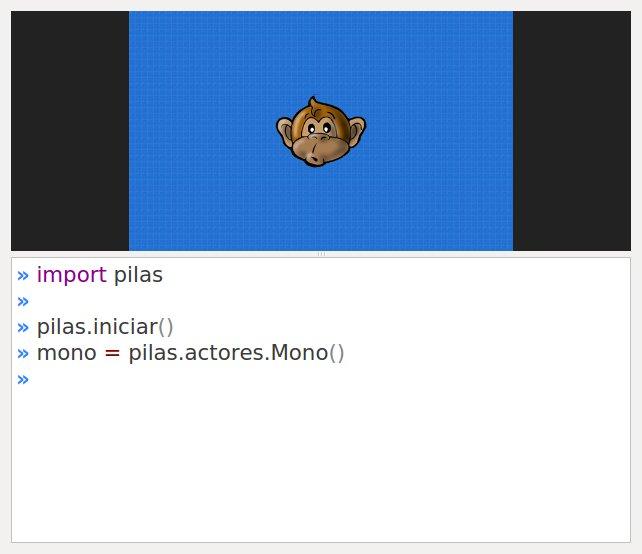

Empezando, los primeros pasos con pilas
=======================================

Si ya tienes instalada la biblioteca podemos
comenzar a realizar nuestros primeros pasos
con la biblioteca.

**pilas** incluye un intérprete interactivo
que te permite escribir código de python y
autocompletar el nombre de las funciones.
Aunque si quieres, puedes usar el intérprete
estándar de python, abriendo un terminal de
texto y ejecutando el comando ``python``.

Iniciando pilas
---------------

Para ejecutar el asistente de **pilas**,
abre un terminal y ejecuta el comando
``pilas``.

En tu pantalla tiene que aparecer una ventana como esta.

Intérprete de pilas
-------------------

Haz click en **Abrir intérprete** y aparecerá esta ventana.

La ventana se divide en dos partes. La parte de abajo muestra el editor. Todo lo
que escribas en el editor se ejecutará automáticamente. El resultado se muestra
en la parte de arriba.

Iniciando la biblioteca
-----------------------

La parte de arriba es la que utilizaremos para interactuar
con el motor. Y mas adelante será la única pantalla
que verán los usuarios de nuestros juegos.

Puedes ver que el intérprete viene con algunas líneas de ejemplo.

.. code-block:: python

    import pilas

    pilas.iniciar()
    mono = pilas.actores.Mono()

La línea ``import pilas`` le dice a Python que use la librería pilas. La función
``pilas.iniciar()`` prepara la ventana (entre otras cosas) para empezar a usar
pilas. La línea ``mono = pilas.actores.Mono()``, por una parte crea un personaje
con forma de mono (**pilas.actores.Mono()**) y, por otra parte, le da el nombre de
**mono**.

La función ``pilas.iniciar()`` tiene mas parámetros, pero los veremos mas
adelante. Por ahora, continuaremos con lo básico.

Creando personajes
---------------------------

Un concepto importante en :mod:`pilas` es del de ``actores``. Un
actor en pilas es un objeto que aparece en pantalla, tiene
una posición determinada y se puede manipular.

Por ejemplo, una nave, un enemigo, una medalla... etc.

Para agilizar el desarrollo de juegos se incluyen varios
actores dentro del motor, uno de ellos es ``Mono``, un
simpático chimpancé.

.. note::
    Puedes ver todos los actores disponibles en :mod:`pilas`
    ejecutando ``pilas.actores.listar_actores()``.

Tenemos al actor ``mono``. Para indicarle
acciones solo tenemos que utilizar su nombre y sentencias
simples.

Por ejemplo, para que el personaje cambie su expresión,
podemos usar sentencias cómo:

.. code-block:: python

    mono.sonreir()

o:

.. code-block:: python

    mono.gritar()

En cualquiera de los dos casos, el personaje
cambiará su aspecto y emitirá un sonido.

.. image:: images/mono/smile.png

Incluso podríamos decirle al personaje
que tiene que hablar algo, por ejemplo:

.. code-block:: python

    mono.decir("Hey, bienvenido a pilas!!!")

y el personaje mostrará exactamente lo que le
indicamos que tiene que decir, cómo si fuera un
personaje de comic:

.. image:: images/mono/decir.png

A partir de ahora, comenzaremos a escribir algunos
ejemplos. Ten en cuenta que no es necesario que
escribas todo el código de los ejemplos, el intérprete de pilas
te permite autocompletar sentencias mientras escribes.

Cosas en común para los actores
-------------------------------

Internamente, ``Mono`` es un actor, así que encontraremos
mucha funcionalidad en él que la tendrán el resto de los
actores.

Veamos algunas de estas características:

Posición
________

Podemos cambiar la posición de un actor mediante las propiedades ``x`` e ``y``:

.. code-block:: python

    mono.x = 100
    mono.y = 100

Ten en cuenta que ``x`` e ``y`` son las coordenadas de posición
en el escenario. Por lo tanto el punto (0, 0) es el centro
de la ventana. Y ``x`` aumenta hacia la derecha e ``y`` hacia arriba.

.. image:: images/mono/normal.png

Este espacio de referencia se puede observar en detalle si pulsas
la tecla **F12**, ahí observarás que el movimiento del mouse
está asociado a una coordenada y cada actor también.

.. note::
    Para que tenga efecto, debes tener seleccionada la ventana de resultado
    (parte de arriba). Haz click sobre ella antes de pulsar F12.

Escala
______

Todo actor tiene un atributo para indicar su tamaño
en pantalla, el atributo ``escala`` (que originalmente vale 1):

.. code-block:: python

    mono.escala = 2

Rotación
________

También contamos con un atributo que indica la rotación en grados que debe
tener el actor en pantalla. El atributo ``rotacion``:

.. code-block:: python

    mono.rotacion = 40

.. image:: images/mono/rotation40.png

o bien:

.. code-block:: python

    mono.rotacion = 80

.. image:: images/mono/rotation80.png

La rotación siempre se indica en grados, e indica
el grado de inclinación hacia la derecha.

Animaciones
___________

Cualquiera de todas las propiedes
que vimos anteriormente se pueden usar para hacer
animaciones, por
ejemplo, con el siguiente código
podríamos indicarle al actor que dé una
vuelta completa:

.. code-block:: python

    mono.rotacion = [360]

¿por qué?, porque los caracteres ``[`` y ``]`` representan
una lista de valores, y cuando pilas ve esta lista asignada
a un atributo de pilas, intenta hacer una animación.

Veamos otro ejemplo, si queremos que un personaje
como el mono se mueva horizontalmente con una animación
podemos escribir esto:

.. code-block:: python

    mono.x = [-200, 200]

Estas animaciones las veremos mas adelante, pero
de todas formas es interesante observar que son
listas comunes y corrientes.

Python permite multiplicar listas, así que podríamos multiplicarlas para repetir
la animación.

.. code-block:: python

    # Sólo en python.
    mono.x = [-200, 200] * 5 # ir de una lado a otro 5 veces.

o incluso podríamos alterarles la velocidad, digamos
que el ir y regresar se tiene que hacer
muy lento, en unos 10 segundos:

.. code-block:: python

    mono.x = [-200, 200], 10

Pidiendo ayuda
--------------

Recuerda que cada componente de :mod:`pilas` está documentado
como un módulo de python. Por lo tanto, puedes
ejecutar una sentencia cómo:

.. code-block:: python

    help(mono)

y aparecerán en pantalla todos los instructivos de
la funcionalidad del actor.

Incluso puedes usar la función ``pilas.ver`` para conocer
el código fuente de cualquier cosa de pilas. Por ejemplo
podemos el código completo del mono ejecutando
la sentencia:

.. code-block:: python

    pilas.ver(mono)

Eliminando a un actor
---------------------

Para eliminar un actor de la escena tienes que llamar
al método ``eliminar``:

.. code-block:: python

    mono.eliminar()

Conclusión
----------

Hemos visto los pasos principales para gestionar
actores. Ten en cuenta que el módulo :mod:`pilas.actores` es
donde se guardarán todos los actores.

Un buen ejercicio es ponerse a investigar el módulo
**actores**. Hay muchos actores, estos son algunos ejemplos
de código para probar:

.. code-block:: python

    b = pilas.actores.Bomba()
    b.explotar()

    p = pilas.actores.Pingu()    # se mueve con el teclado.

Es todo por ahora, seguí leyendo o comenzá
a explorar por tu cuenta. A divertirse!
