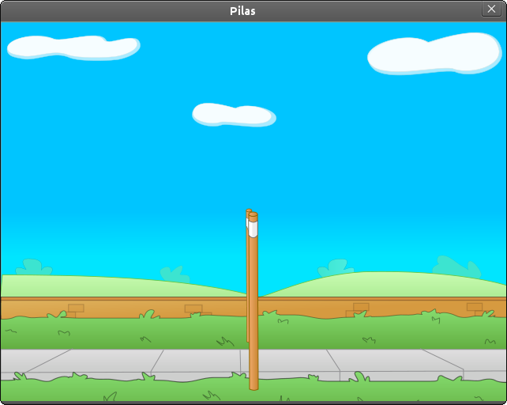
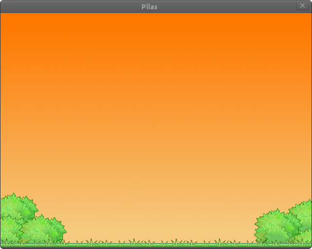

Escenas
=======

Las escenas te permiten dividir el juego en partes
reconocibles y que interactúan de manera diferente
con el usuario.

Un juego típico tendrá al menos una escena cómo
el menú principal, una presentanción y una
pantalla de juego.

Cosas a tener en cuenta
-----------------------

Hay algunas cosas a tener en cuenta
a la hora de manejar escenaas, porque
simplifican mucho el trabajo posterior:

- La escena actual siempre está señalada por el atributo ``pilas.mundo.escena_actual``.
- Solo puede existir una escena a la vez.
- Cuando se cambia de escena, generalmente la misma escena eliminará a todos los actores del escenario.

La escena Normal
----------------

Cuando iniciamos pilas por primera vez se creará
una escena llamada ``Normal``. Esta escena no
tiene un comportamiento muy elaborado, simplemente
imprime toda la pantalla de gris para que
podamos colocar actores sobre ella y veamos una
escena limpia.

Cambiando el fondo de las escenas
---------------------------------

Para hacer un pequeña prueba sobre una
escena, podrías ejecutar la siguiente sentencia
de código:

.. code-block:: python

    pilas.fondos.Volley()

Esto le dará a tu escena una vista
mas agradable, porque carga un fondo de
pantalla colorido y mas divertido:

o podrías usar un fondo de atardecer: 

.. code-block:: python

    pilas.fondos.Tarde()

Cómo crear nuevas escenas
-------------------------

Imagina que tienes un juego con dos pantallas, una
que simplemente dice "bienvenido" y  otra con
un personaje para mover.

Claramente tendríamos que hacer dos escenas, e iniciar
nuestro juego creando la escena principal y dándole
el control del juego completo.

La primer escena tendríamos que representarla
con una clase, que herede de la escena Normal
así:

.. code-block:: python

    class PantallaBienvenida(pilas.escenas.Normal):

        def __init__(self):
            pilas.escenas.Normal.__init__(self)
            pilas.fondos.Pasto()
            texto = pilas.actores.Texto("Bienvenido a pilas!!!")

Ahora, para poner en funcionamiento esta escena
simplemente tienes que crear un objeto de esa
clase:

.. code-block:: python

    PantallaBienvenida()

Esto eliminará la escena actual y se colocará como la escena
actual:

.. image:: images/escena_simple.png

Ahora, si quieres salir de la escena, simplemente tendrías
que hacer un objeto de otra clase que represente otra escena. Eso
invocará el cambio de escena inmediatamente.
