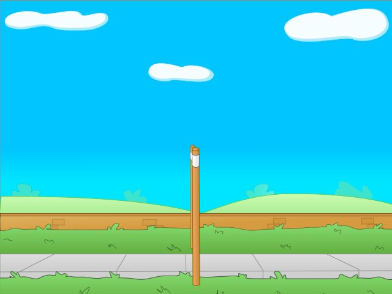
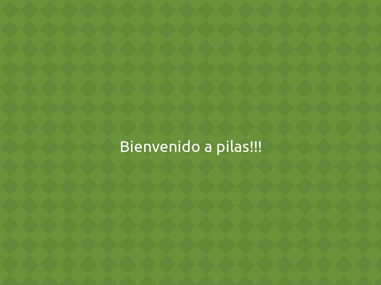

Escenas
=======

Las escenas te permiten dividir el juego en partes
reconocibles y que interactúan de manera diferente
con el usuario.

Un juego típico tendrá al menos una escena cómo
el menú principal, una presentanción y una
pantalla de juego.

.. image:: images/escenas_juego.png

Cosas a tener en cuenta
-----------------------

Hay algunas cosas a tener en cuenta
a la hora de manejar escenas, porque
simplifican mucho el trabajo posterior:

- La escena actual siempre está señalada por el atributo ``pilas.escena_actual()``.
- Solo puede existir una escena activa a la vez.

La escena Normal
----------------

Cuando iniciamos pilas por primera vez se creará
una escena llamada ``Normal``. Esta escena no
tiene un comportamiento muy elaborado, simplemente
imprime toda la pantalla de gris para que
podamos colocar actores sobre ella y veamos una
escena limpia.

Pausando el juego
-----------------

En cualquier momento del juego podemos ejecutar ``pilas.escena.pausar()``
y el juego quedará pausado hasta que se pulse la tecla ESC y vuelva a la 
ejecución normal del juego.

Este comando es un atajo que carga la escena ``Pausa``.
Puedes crear tu propia pantalla de PAUSA heredando de ``pilas.escena.Pausa``.

Cambiando el fondo de las escenas
---------------------------------

Para hacer una pequeña prueba sobre una
escena, podrías ejecutar la siguiente sentencia
de código:

.. code-block:: python

    pilas.fondos.Volley()

Esto le dará a tu escena una vista
mas agradable, porque carga un fondo de
pantalla colorido y mas divertido:

o podrías usar un fondo de atardecer:

.. code-block:: python

    pilas.fondos.Tarde()

.. image:: images/tarde.jpg

Cómo crear nuevas escenas
-------------------------

Imagina que tienes un juego con dos pantallas, una
que simplemente dice "bienvenido" y  otra con
un personaje para mover.

Claramente tendríamos que hacer dos escenas, e iniciar
nuestro juego creando la escena principal.

La primer escena tendríamos que representarla
con una clase, que herede de la escena Normal
así:

.. code-block:: python

    class PantallaBienvenida(pilas.escena.Normal):

        def __init__(self):
            pilas.escena.Normal.__init__(self)

        def iniciar(self):
            pilas.fondos.Pasto()
            texto = pilas.actores.Texto("Bienvenido a pilas!!!")

Ahora, para poner en funcionamiento esta escena
simplemente tienes que decirle a pilas que esta escena es la activa:

.. code-block:: python

    pilas.cambiar_escena(PantallaBienvenida())

Esto eliminará las escenas almacenadas y se colocará como la escena
actual y activa:

.. seealso:: Mira la documentación :ref:`ref_gestor_de_escenas` para comprender mejor el apilamiento de escenas.

Ahora, si quieres salir de la escena, simplemente tendrías
que hacer un objeto de otra clase que represente otra escena y llamar a uno de
estos tres metodos:

- pilas.cambiar_escena(mi_escena)
- pilas.almacenar_escena(mi_escena)
- pilas.recuperar_escena()

Método sobreescribibles
-------------------------

Dentro de cada escena existen 2 métodos que pueden ser sobreescritos.

.. code-block:: python

    def pausar(self):
        pass

    def reanudar(self):
        pass

Si quieres tener el control de cuando una escena se queda apilada, deberás
sobreescritir el método:

.. code-block:: python

    def pausar(self):
        pass

Si quieres sabes cuando una escena apilada vuelve a ser la escena activa,
deberás sobreescribir el método:

.. code-block:: python

    def reanudar(self):
        pass
