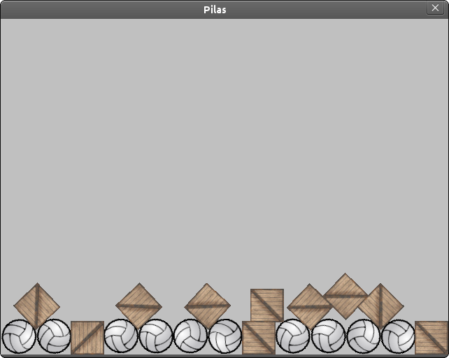
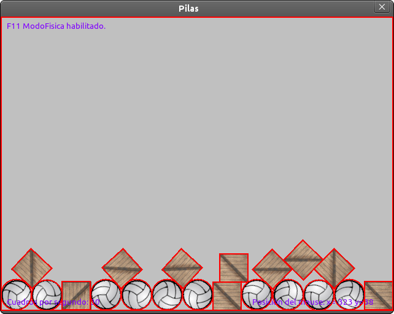
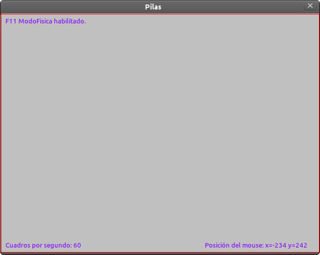
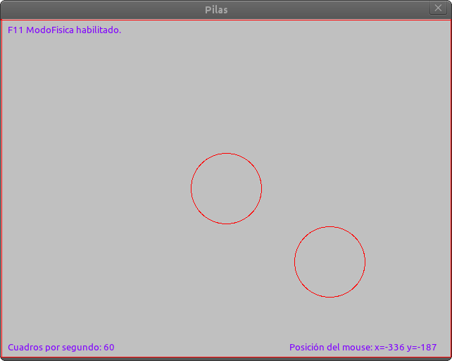
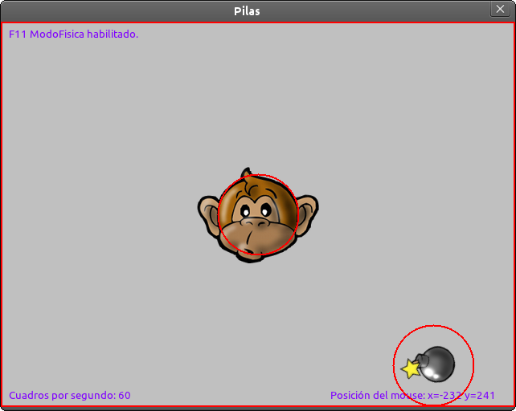

Física
======

Pilas incluye integración con un sistema de física
para realizar simulaciones y dotar a tus juegos
de mas realismo y diversión.

El protagonista es Box2D
------------------------

Así cómo pilas elegimos usar usar motores gráficos externos (pygame o
sfml), también optamos por usar un motor de física
externo libre y muy utilizado llamado Box2D.

El módulo ``pilas.fisica`` es simplemente una facilidad
que te permite integrar comportamiento realista a tus
juegos de manera muy sencilla.

Unos ejemplos
-------------

El motor de física se puede mostrar en funcionamiento
usando un ejemplo, escribe el siguiente código:

.. code-block:: python

    pelotas = pilas.atajos.fabricar(pilas.actor.Pelota, 10)

esto creará un grupo de circunferencias que rebotarán
hasta la parte inferior de la pantalla.

De manera similar puedes crear un montón de cajas y
hacerlas rebotar:

.. code-block:: python

    pelotas = pilas.atajos.fabricar(pilas.actor.Caja, 10)

Modo depuración de física
-------------------------

Cuando haces juegos con física o movimientos realistas es
muy importante tener la seguridad de que la geometría de
las figuras está correctamente configurada.

Observa esta escena:

Cada uno de esos actores está asociado a una figura
geométrica, pero para asegurarte de ello puedes pulsar
en cualquier momento la tecla F11 y observar las lineas
de color amarillo:

Las lineas de color amarillo indican polígonos que el
motor de física puede controlar, las cajas tienen forma
rectangular, los actores Pelota tienen figuras circulares, y
el suelo y las paredes también están en el sistema de física.

Si por algún motivo quiere que los objetos "caigan" saliendo
de la pantalla podrías eliminar el suelo o las paredes escribiendo
lo siguiente:

.. code-block:: python

    pilas.mundo.fisica.eliminar_suelo()
    pilas.mundo.fisica.eliminar_paredes()

Física personalizada
--------------------

Los actores ``Pelota`` y ``Caja`` están bien para simulaciones
simples y generales. Pero, ¿cómo podemos dotar a nuestros
propios actores de ese comportamiento?.

Los objetos o figuras físicas viven dentro del módulo de física
y son invisibles (al principio), pero luego se pueden vincular
a cualquier actor con facilidad.

Intenta lo siguiente, ingresa en el modo interactivo de pilas
y pulsa la tecla F11. Tendrías que ver el texto "ModoFisica Habilitado" 
en la esquina superior de la ventana:

Ahora genera dos figuras físicas, una circunferencia estática
y otra dinámica:

.. code-block:: python

    circulo = pilas.fisica.Circulo(0, 0, 50, dinamica=False)
    circulo_dinamico = pilas.fisica.Circulo(10, 200, 50)

El primer círculo aparecerá en el centro de la ventana, y el
segundo comenzará en la posición (10, 200), es decir, en la parte
superior de la ventana y luego caerá rebotando... algo así:

Ahora bien, habrás notado que estas dos circunferencias las
podemos ver porque está habilitado el módulo de depuración (que
activamos con F11), pero esto no lo va a ver alguien que juegue
a nuestro juego. El modo depuración es solo para desarrolladores.

Lo que nos falta hacer, es darles apariencia a esas figuras. Algo
así como un piel..

Para esto podemos usar actores. La dinámica es así, tenemos que
crear dos actores, y luego decirle a estos actores que se comporten
cómo figuras geométricas.

Agreguemos a nuestro programa estas 4 lineas de código, queremos
que el primer circulo (el del centro) sea un mono, y el otro
círculo que sea una bomba:

.. code-block:: python

    mono = pilas.actores.Mono()
    mono.aprender(pilas.habilidades.Imitar(circulo))
    
    bomba = pilas.actores.Bomba()
    bomba.aprender(pilas.habilidades.Imitar, circulo_dinamico)

Esto es diferente a lo anterior, los objetos físicos tienen apariencia:

Ahora podríamos desactivar el modo depuración física (pulsando
nuevamente **F11**) y jugar un poco impulsando la bomba de un
lado a otro:

.. code-block:: python

    circulo_dinamico.y = 200

Ten en cuenta que ahora la figura del motor físico es la
que determina el movimiento y la rotación, así que ya no
funcionará escribir algo cómo ``bomba.y = 200``, ahora tienes
que escribir ``circulo_dinamico.y = 200`` para mover al actor...

Otra cosa a considerar, es que en nuestro ejemplo no ajustamos
muy bien el tamaño del ``circulo_dinamico`` con el de la
bomba. Esto es un detalles poco relevante aquí, porque solo
quiero explicar cómo se usar el motor, pero cuando hagas tus
juegos recuerda usar el modo depuración de física para detectar
estos detalles y corregirlos, son muy importantes para que
tus usuarios disfruten del juego. Recuerda que ellos no
verán los círculos amarillos...

Cambiando la gravedad interactivamente
--------------------------------------

Por defecto, la gravedad del escenario es de (0, -90), esto
significa que los objetos "caen" hacia abajo, y lo hacen con
una aceleración de 90 (mts por segundo).

Pero no estás obligado a que esto sea siempre así, de hecho
si quieres hacer un juego que transcurra en el espacio seguramente
vas a querer eliminar por completo la gravedad del escenario
para que los objetos puedan "flotar", ¿no?.

Entonces, hay dos formas de cambiar la gravedad del escenario. Podrías
cambiar la gravedad en cualquier momento invocando a la función
``definir_gravedad`` indicando la nueva gravedad, por ejemplo:

.. code-block:: python

    pilas.fisica.definir_gravedad(200, 0)

o directamente especificar la gravedad cuando inicias pilas, por
ejemplo:

.. code-block:: python

    pilas.fisica.definir_gravedad(90, 90)

Ten en cuenta que el primer argumento es la aceleración horizontal y
la segunda componente es la aceleración vertical. Los valores originales
de la gravedad son ``0`` y ``-90``. 
