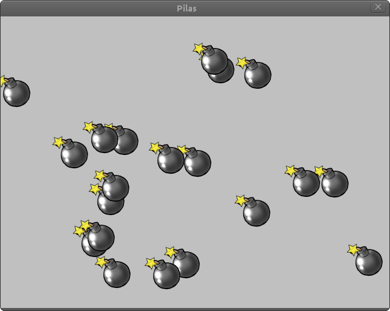
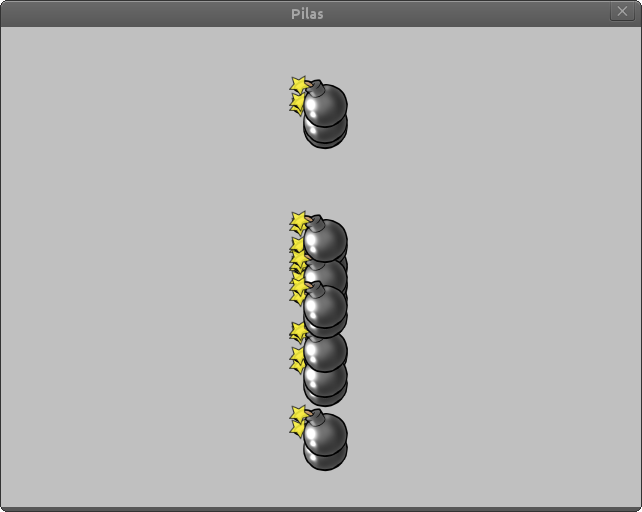
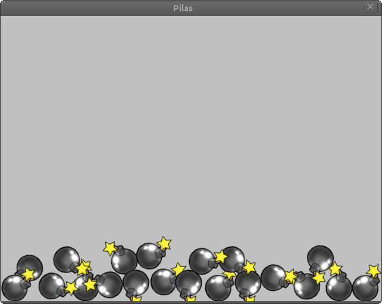
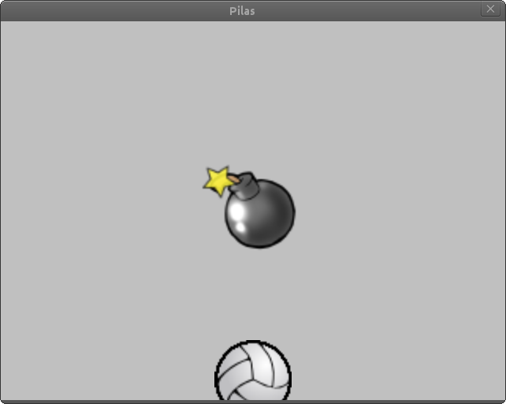

Grupos
======

Ahora que podemos manejar a los actores de manera individual. Vamos
a ver organizarlos en grupos.

Organizar a los actores en grupo es de utilidad, porque generalmente
es una buena idea agrupar a los actores por características y
tratarlos a todos por igual. Por ejemplo, en un juego de naves
podríamos tener un grupo de naves, un grupo de estrellas y un
grupo de disparos.

Creando grupos de actores
-------------------------

Para crear varios actores de una misma clase
podríamos ejecutar algo como lo que sigue:

.. code-block:: python

    bombas = pilas.actores.Bomba() * 5

es decir, creamos un actor y luego lo multiplicamos
para construir un grupo con muchos actores de la misma
especie.

Al crear un grupo de esta forma, todos los actores
se colocarán en posiciones aleatorias.

Esto es lo que veríamos en la ventana de pilas:

A partir de ahora, la referencia ``bombas`` nos servirá para
controlar a todas las bombas al mismo tiempo.

Esta referencia es parecida a una lista de python
normal. Así que podríamos contar cuantas bombas
hay en la escena, o recorrer el grupo haciendo algo:

.. code-block:: python

    >>> print "hay", len(bombas), "bombas"
    hay 5 bombas
    
    >>> for una_bomba in bombas:
    ...     print una_bomba.x, una_bomba.y

Ahora bien, algo que hace un poquito diferente a los
grupos de las listas de python, es que los grupos
te permiten alterar a varios actores al mismo tiempo
con mas facilidad.

Por ejemplo, imagina que quieres hacer que todas las
bombas aparezcan en el centro de la ventana. Podrías
hacer algo cómo esto:

.. code-block:: python

    bombas.x = 0

Y en la ventana obtendremos:

Incluso, les podríamos enseñar a las bombas a reaccionar
como si fueran pelotas, es decir, que reboten e interactúen
con la aceleración gravitatoria:

.. code-block:: python

    bombas.aprender(pilas.habilidades.RebotaComoPelota)

Ahora tendrás algo mucho mas interesante, un montón de
actores rebotando entre sí:

Un consejo, la gravedad del escenario se puede modificar
usando una sentencia como la que sigue:

.. code-block:: python

    pilas.atajos.definir_gravedad(200, 0)

donde el primer argumento es la gravedad horizontal, en este caso 200
es hacia la derecha, y la gravedad vertical, que suele ser de -90
en general.

Pruebalo, es divertido!

Creando un grupo para distintos actores
---------------------------------------

Hay ocasiones, donde quieres tener un grupo
desde cero e ir agregando actores en él.

Esto se puede hacer fácilmente, e incluso
abre las puertas a que puedas mezclar actores
de distintas especies.

Para crear un grupo vacío tienes que crear
un objeto de la clase Grupo:

.. code-block:: python

    mi_grupo = pilas.grupo.Grupo()

y luego, para añadir actores al grupo puedes usar el
método ``append`` e indicar la referencia del actor
que quieres agregar:

.. code-block:: python
    
    bomba = pilas.actores.Bomba()
    pelota = pilas.actores.Pelota()

    mi_grupo.append(bomba)
    mi_grupo.append(pelota)

    mi_grupo.escala = [2]

