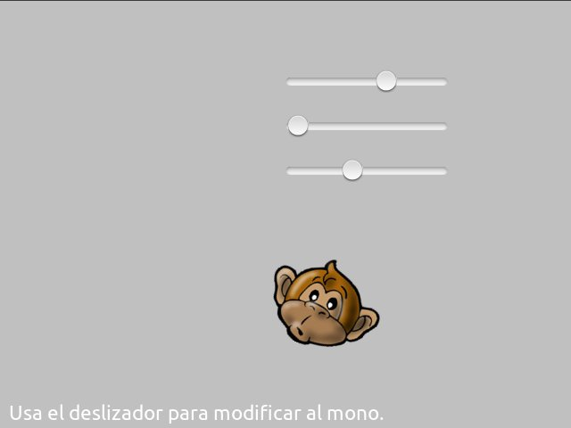
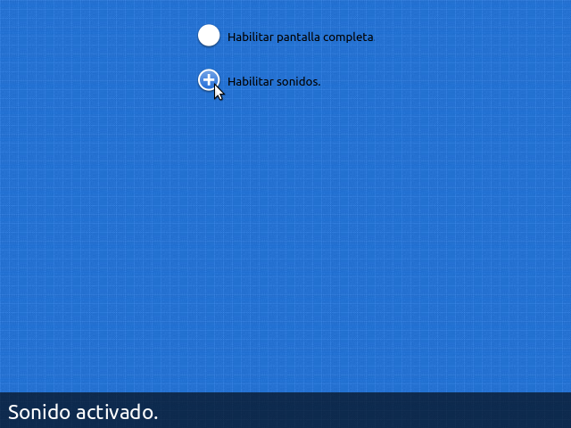
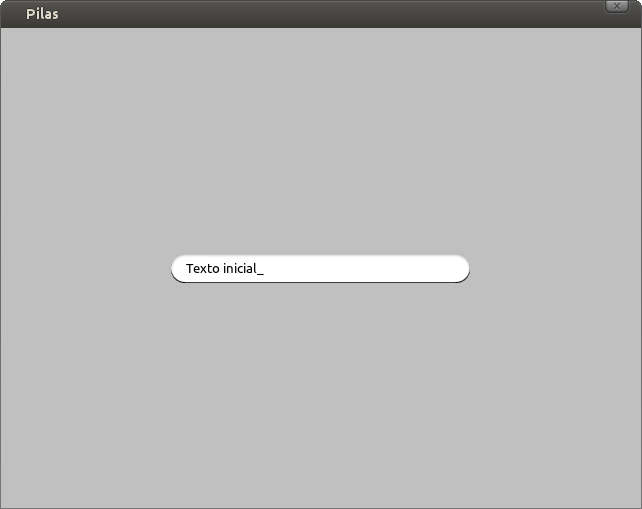

Interfaz de usuario
===================

Pilas incluye un submódulo que te permitirá crear
una interfaz de usuario con deslizadores, botones, cajas
de texto y selectores.

Este submódulo tiene objetos basados en actores, así que
lo que conoces sobre actores vas a poder usarlo para construir
una interfaz.

Propiedades comunes
-------------------

Todos lo elementos de la interfaz comparten una serie de propiedades como:

:activar: Permite que un control sea seleccionado y que el usuario interactue
 con él. Por defecto todos los controles están activados.

.. code-block:: python

    entrada = pilas.interfaz.IngresoDeTexto()
    entrada.texto = "Texto inicial"
    
    entrada.activar()

:descativar: Bloquea el control para que el usuario no pueda utilizarlo.
 El control se queda semi-transparente para indicar este estado. 

.. code-block:: python
   
    entrada.desactivar()

:ocultar: Oculta el control en la pantalla.

.. code-block:: python
   
    entrada.ocultar()

:mostrar: Muestra el control y lo activa.

.. code-block:: python
   
    entrada.mostrar()

:obtener_foco: Establece el control como activo.

.. code-block:: python
   
    entrada.obtener_foco()

Deslizador
----------

El deslizador es útil para que el usuario pueda seleccionar
un valor intermedio entre dos números, por ejemplo entre 0 y 1, 0 y
100 etc.

Un ejemplo típico de este componente puedes encontrarlo
en las preferencias de audio de algún programa de sonido, los
deslizadores te permiten regular el grado de volumen.

Esta es una imagen del ejemplo ``deslizador.py`` que está
en el directorio ``ejemplos``. Tiene tres deslizadores, y
el usuario puede regular cualquiera de los tres para ver
los cambios en el actor:

Para construir un deslizador y asociarlo a una función
puedes escribir algo como esto:

.. code-block:: python

    def cuando_cambia(valor):
        print "El deslizador tiene grado:", valor

    deslizador = pilas.interfaz.Deslizador()
    deslizador.conectar(cuando_cambia)

Entonces, a medida que muevas el deslizador se imprimirán
en pantalla valores del 0 al 1, por ejemplo 0.25, 0.52777 etc...

Si quieres cambiar los valores iniciales y finales de la 
escala de valores, lo mas sencillo es multiplicar el argumento
``valor`` de la función. Por ejemplo, si quieres valores entre
0 y 100:

.. code-block:: python

    def cuando_cambia(valor):
        valor_entre_cero_y_cien = valor * 100
        

Selector
--------

El selector te permite seleccionar una opción con
dos valores: habilitado, deshabilitado.

Se puede usar para opciones cómo habilitar o deshabilitar
el modo pantalla completa o algo así.

Para usarlo, se tiene que crear un objeto de la
clase ``Selector`` y un texto a mostrar:

.. code-block:: python

    selector = pilas.interfaz.Selector("Habilitar pantalla completa.", x=0, y=200)

Y luego, puedes consultar el valor del selector mediante el
atributo ``seleccionado``:

.. code-block:: python

    if selector.seleccionado:
        print "El selector esta seleccionado."
    else:
        print "El selector no esta seleccionado."

o directamente asociarle una función para que el selector
la llame cuando cambia de estado:

.. code-block:: python

    def cuando_el_selector_cambia(estado):
        print "El selector ahora esta en estado:", estado

    selector.definir_accion(cuando_el_selector_cambia)

Ingreso de texto
----------------

Si quieres solicitar datos, como el nombre del usuario, puedes
usar el objeto ``IngresoDeTexto``. Ya que muestra una caja
y un pequeño cursor para ingresar texto:

Para usar este componente tienes que crearlo y luego
leer o escribir el atributo ``texto``, que contiene la
cadena de texto de la caja:

.. code-block:: python

    entrada = pilas.interfaz.IngresoDeTexto()
    entrada.texto = "Texto inicial"

Inicialmente, el objeto ``IngresoDeTexto`` toma un tamaño
y apariencia predeterminado. Pero esto se puede cambiar
fácilmente usando argumentos al momento de crear
el componente.

Por ejemplo, podríamos enviarle cómo argumento un
tamaño mas pequeño y un ícono de búsqueda:

.. code-block:: python

    entrada = pilas.interfaz.IngresoDeTexto(ancho=100, icono='iconos/lupa.png')

u otro ícono:

.. code-block:: python

    entrada = pilas.interfaz.IngresoDeTexto(ancho=100, icono='iconos/ok.png')

La caja también tiene otros métodos para permitir o prohibir
el ingreso de datos.

Por ejemplo, podríamos decirle a la caja que solo permita
el ingreso de números, letras, o poner un límite de cantidad
de caracteres. Los métodos son:

- solo_numeros()
- solo_letras()

y el límite de caracteres está indicado por la referencia ``limite_de_caracteres``:

.. code-block:: python

    print "El limite de caracteres es"
    print entrada.limite_de_caracteres

    entrada.limite_de_caracteres = 50
    
Lista de selección
------------------

La lista de selección se utiliza para mostrar al usuario
una lista de cadenas, y permitirle seleccionarlas
con el mouse.

Para crear un lista de selección, se tiene que crear
una lista de cadenas y declarar una función para que
sea llamada cuando se termina de seleccionar.

Por ejemplo, el siguiente código muestra una lista
e imprime por consola cuando el usuario selecciona
con el click del mouse:

.. code-block:: python

    def cuando_selecciona(opcion):
        print "Ha seleccionado la opcion:", opcion
       
    consulta = pilas.interfaz.ListaSeleccion(['Uno', 'Dos', 'Tres'], cuando_selecciona)
