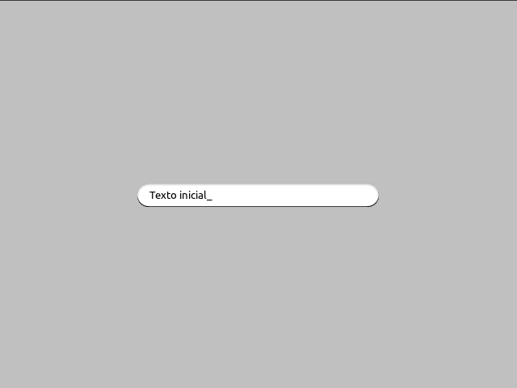

Interfaz de usuario
===================

Pilas incluye un submódulo que te permitirá crear
una interfaz de usuario con deslizadores, botones, cajas
de texto y selectores.

Este submódulo tiene objetos basados en actores, así que
lo que conoces sobre actores vas a poder usarlo para construir
una interfaz.

Deslizador
----------

El deslizador es útil para que el usuario pueda seleccionar
un valor intermedio entre dos números, por ejemplo entre 0 y 1, 0 y
100 etc.

Un ejemplo típico de este componente puedes encontrarlo
en las preferencias de audio de algún programa de sonido, los
deslizadores te permiten regular el grado de volumen.

Esta es una imagen del ejemplo ``deslizador.py`` que está
en el directorio ``ejemplos``. Tiene tres deslizadores, y
el usuario puede regular cualquiera de los tres para ver
los cambios en el actor:

.. image:: images/deslizador.png

Para construir un deslizador y asociarlo a una función
puedes escribir algo como esto:

.. code-block:: python

    def cuando_cambia(valor):
        print "El deslizador tiene grado:", valor

    deslizador = pilas.interfaz.Deslizador()
    deslizador.conectar(cuando_cambia)

Entonces, a medida que muevas el deslizador se imprimirán
en pantalla valores del 0 al 1, por ejemplo 0.25, 0.52777 etc...

Si quieres cambiar los valores iniciales y finales de la 
escala de valores, lo mas sencillo es multiplicar el argumento
``valor`` de la función. Por ejemplo, si quieres valores entre
0 y 100:

.. code-block:: python

    def cuando_cambia(valor):
        valor_entre_cero_y_cien = valor * 100
        

Selector
--------

El selector te permite seleccionar una opción con
dos valores: habilitado, deshabilitado.

Se puede usar para opciones cómo habilitar o deshabilitar
el modo pantalla completa o algo así.

Para usarlo, se tiene que crear un objeto de la
clase ``Selector`` y un texto a mostrar:

.. code-block:: python

    selector = pilas.interfaz.Selector("Habilitar pantalla completa.", x=0, y=200)

Y luego, puedes consultar el valor del selector mediante el
atributo ``seleccionado``:

.. code-block:: python

    if selector.seleccionado:
        print "El selector esta seleccionado."
    else:
        print "El selector no esta seleccionado."

Ingreso de texto
----------------

Si quieres solicitar datos, como el nombre del usuario, puedes
usar el objeto ``IngresoDeTexto``. Ya que muestra una caja
y un pequeño cursor para ingresar texto:

Para usar este componente tienes que crearlo y luego
leer o escribir el atributo ``texto``, que contiene la
cadena de texto de la caja:

.. code-block:: python

    entrada = pilas.interfaz.IngresoDeTexto()
    entrada.texto = "Texto inicial"
