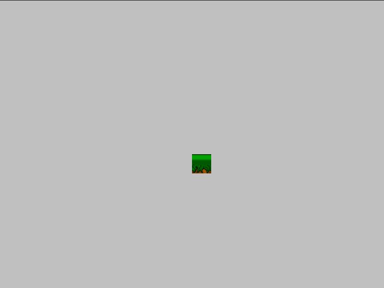
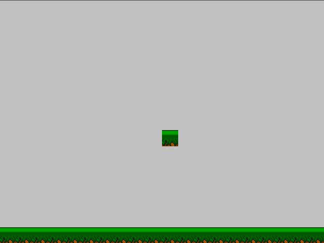

Mapas y plataformas
===================

En los años 80 uno de los géneros de videojuegos mas
celebrados ha sido el genero de plataformas.

En los juegos de este género el protagonista de la
aventura estaba en un escenario armado de bloques y
plataformas en donde podía saltar.

Uno de los juegos mas populares de esos días era
Super Mario Bros.

Pilas incluye un actor llamado ``Mapa`` que te permite
hacer juegos de plataformas fácilmente.

Presentando el actor ``Mapa``
-----------------------------

El ``Mapa`` representa un escenario compuesto de bloques
que pueden ser plataformas, muros o simplemente adornos
del escenario.

Para crear un ``Mapa`` necesitas una grilla de gráficos con los bloques
que se usarán en el escenario. Luego puedes crear el ``Mapa``:

.. code-block:: python

    grilla = pilas.imagenes.cargar_grilla("grillas/plataformas_10_10.png", 10, 10)
    mapa = pilas.actores.Mapa(grilla)

Una vez que ejecutas esas sentencias no observarás cambios
en la ventana, el mapa está, pero no tiene bloques aún.

Si quieres dibujar bloques solo tienes que indicar un
índice de bloque y la posición en pantalla a dibujar.

Por ejemplo, un bloque cerca del centro de la ventana es
la posición (8, 10):

.. code-block:: python

    mapa.pintar_bloque(8, 10, 1)

Otro ejemplo: si queremos dibujar en la parte inferior de la
ventana, podemos llamar muchas veces al método ``pintar_bloque``, una
vez por cada bloque que necesitamos:

.. code-block:: python

    for columna in range(20):
        mapa.pintar_bloque(14, columna, 1)

El primer y segundo argumento del método ``pintar_bloque`` indica
la posición en donde vamos a dibujar el bloque. En este caso la
fila será 14 y la columna será 0, 1, 2, 3, 4.. etc

El tercer argumento será el índice de la grilla que indicamos
anteriormente.

Este será el resultado:

Colisiones con el escenario
---------------------------

En los juegos de plataformas es muy importante que los bloques
puedan interactuar con los jugadores. Por ejemplo habrá bloques
que sirvan como plataformas y otros impedirán que avancemos como
si se trataran de muros.

Los mapas de pilas te permiten crear esta interacción de manera
sencilla. El método que usamos antes ``pintar_bloque``, le
dice al mapa que dibuje el bloque, pero a la vez te permite
indicar si ese bloque es sólido o no.

Diremos que un bloque es sólido cuando un personaje no puede
pasar a través de él. Por ejemplo, una plataforma es un bloque
sólido.

Entonces, cada vez que invocas al método ``pintar_bloque`` tienes
la posibilidad de indicar si el bloque es sólido o no:

.. code-block:: python

    mapa.pintar_bloque(14, 10, 1, es_bloque_solido=True)
    mapa.pintar_bloque(14, 10, 1, es_bloque_solido=False)

Y ten en cuenta que si no especificas el último parámetro, pilas
asumirá que el bloque debe ser sólido.

Por cierto, los bloques "no sólidos" son útiles para representar
adornos del escenario, como nubes o agua. Incluso en algunos
juegos se usan para crear pasadizos secretos entre muros o 
plataformas...

Creando mapas con el programa tiled
-----------------------------------

Crear los mapas directamente desde el código está bien, pero
si tienes que hacer muchos mapas te llevará un montón de tiempo.

Una buena alternativa a esto es usar un software de diseño
de escenarios, crear un archivo con todo el escenario y
luego cargarlo desde pilas.

El software que te recomiendo para esta tarea se llama ``tiled``
(ver http://www.mapeditor.org).

Veamos como usar tiled para crear un escenario sencillo, primero
tienes que crear un mapa desde el menú ``File``, se le solicitará
indicar el tamaño del escenario:

.. image:: images/tiled2.png

Usa los valores por defecto, al menos por esta vez.

Luego tienes que ir al menú ``Map`` y luego ``New tileset`` para
indicar cual es la grilla de imágenes que usarás en los bloques. Te
recomiendo usar la imagen ``batalhao.png`` (de Silveins Neto), que
está en la carpeta de ejemplos de pilas:

.. image:: images/tiled3.png

Ahora, lo mas divertido, comienza a dibujar sobre el escenario
seleccionando bloques. Observa que el programa tiene varias herramientas
para hacer que esto sea mucho mas sencillo:

.. image:: images/tiled4.png

Luego, asegúrate de que el programa guarda todos los datos en formato CSV, esto
es importante para que se pueda vincular con pilas. Para esto tienes
que abrir el menú ``Edit`` y luego ``Preferences``, la pantalla de opciones
te tiene que quedar así:

.. image:: images/tiled5.png

Listo, ahora solamente hay que guardar el mapa en un archivo. Ve al menú
``File`` y luego selecciona ``Save as``, tienes que darle un nombre
al archivo ``.tmx``.

Luego, desde pilas, es muy simple, solamente tienes que crear
el actor mapa indicando el nombre del archivo ``.tmx`` que has
generado con el programa **tiled**:

.. code-block:: python

    import pilas
    pilas.iniciar()
    mapa_desde_archivo = pilas.actores.MapaTiled("archivo.tmx")

Creando bloques sólidos con tiled
---------------------------------

Si quieres hacer bloques sólidos desde **tiled** solamente
tienes que crear mas capas, la capa 0 se utilizará como
decorado (todos los bloques son no-sólidos) y el resto de las
capas serán siempre de bloques sólidos.

Por ejemplo, en el escenario anterior, sería interesante colocar
los bloques de pasto y la ruta en la capa que he llamado "suelo"
y el resto de los objetos en otras capas como "obstáculos" y "paredes":

.. image:: images/tiled6.png

Un ejemplo completo
-------------------

Te recomiendo que observes el ejemplo ``mapa_desde_archivo.py`` del
directorio de ejemplos de pilas, podrás observar un escenario
muy simple con obstáculos y un personaje que se puede mover
con el teclado:

.. image:: images/tiled8.png
