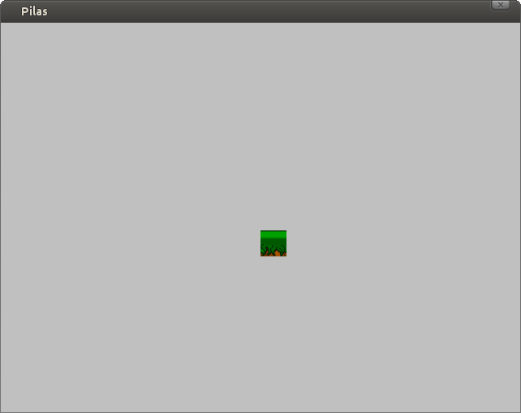
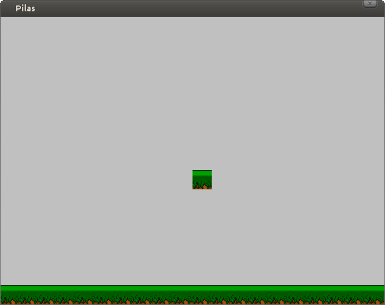

Mapas y plataformas
===================

En los años 80 una de los géneros de videojuegos mas
celebrados ha sido el genero de plataformas.

En los juegos de este género el protagonista de la
aventura estaba en un escenario armado de bloques y
plataformas en donde podía saltar.

Uno de los juegos mas populares de esos días era
Super Mario Bros.

Pilas incluye un actor llamado ``Mapa`` que te permite
hacer juegos de plataformas fácilmente.

Presentando el actor ``Mapa``
-----------------------------

El ``Mapa`` representa un escenario compuesto de bloques
que pueden ser plataformas, muros o simplemente adornos
del escenario.

Para crear un ``Mapa`` necesitas una grilla de gráficos con los bloques
que se usarán en el escenario. Luego puedes crear el ``Mapa``:

.. code-block:: python

    grilla = pilas.imagenes.Grilla("grillas/plataformas_10_10.png", 10, 10)
    mapa = pilas.actores.Mapa(grilla)

Una vez que ejecutas esas sentencias no observarás cambios
en la ventana, el mapa está, pero no tiene bloques aún.

Pulsa la tecla F12 y observarás una grilla con números, cada
número te muestra la fila y columna que representa a ese
rectángulo:

.. image:: images/mapa_depuracion.png

Si quieres dibujar bloques solo tienes que indicar la posición
en el mapa y el índice que representa la imagen en la grilla.

Por ejemplo, un bloque cerca del centro de la ventana es
la posición (8, 10):

.. code-block:: python

    mapa.pintar_bloque(8, 10, 1)

Otro ejemplo: si queremos dibujar en la parte inferior de la
ventana, podemos llamar muchas veces al método ``pintar_bloque``, una
vez por cada bloque que necesitamos:

.. code-block::

    for columna in range(20):
        mapa.pintar_bloque(14, columna, 1)

El primer y segundo argumento del método ``pintar_bloque`` indica
la posición en donde vamos a dibujar el bloque. En este caso la
fila será 14 y la columna será 0, 1, 2, 3, 4.. etc

El tercer argumento será el índice de la grilla que indicamos
anteriormente.

Este será el resultado:

Colisiones con el escenario
---------------------------

En los juegos de plataformas es muy importante que los bloques
puedan interactuar con los jugadores. Por ejemplo habrá bloques
que sirvan como plataformas y otros impedirán que avancemos como
si se trataran de muros.

Los mapas de pilas te permiten crear esta interacción de manera
sencilla. El método que usamos antes ``pintar_bloque``, le
dice al mapa que dibuje el bloque, pero a la vez te permite
indicar si ese bloque es sólido o no.

Diremos que un bloque es sólido cuando un personaje no puede
pasar a través de él. Por ejemplo, una plataforma es un bloque
sólido.

Entonces, cada vez que invocas al método ``pintar_bloque`` tienes
la posibilidad de indicar si el bloque es sólido o no:

.. code-block:: python

    mapa.pintar_bloque(14, 10, 1, solido=True)
    mapa.pintar_bloque(14, 10, 1, solido=False)

Y ten en cuenta que si no especificas el último parámetro, pilas
asumirá que el bloque debe ser sólido.

Por cierto, los bloques "no sólidos" son útiles para representar
adornos del escenario, como nubes o agua. Incluso en algunos
juegos se usan para crear pasadizos secretos entre muros o 
plataformas...

