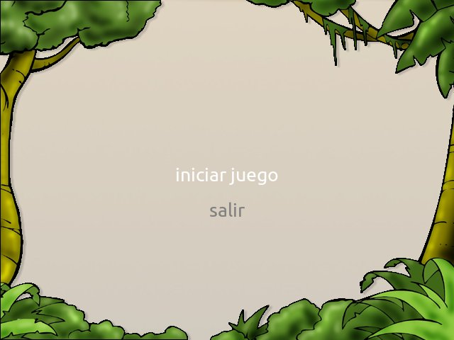

Como crear menúes para tu juegos
================================

Para crear menúes en tus juegos puedes usar
el actor ``Menu``.

El actor ``Menu`` tiene la funcionalidad de
representar opciones y que le puedas asociar
nombres de funciones para invocar.

Un menú sencillo podría tener dos opciones, una
para iniciar el juego y otra para salir:

.. code-block:: python

    import pilas

    pilas.iniciar()
    pilas.fondos.Selva()

    def iniciar_juego():
        print "Tengo que iniciar el juego"

    def salir_del_juego():
        print "Tengo que salir..."

    pilas.actores.Menu(
            [
                ('iniciar juego', iniciar_juego),
                ('salir', salir_del_juego),
            ])

    pilas.ejecutar()

Si escribes este texto en un programa, funciona, aunque no
es muy útil: solamente creará una ventana con dos
opciones, que se pueden seleccionar usando el
teclado.

Esta es una imagen de cómo se vé el menú del
ejemplo de mas arriba:

Cada vez que selecciones una opción aparecerá un
mensaje en la consola de python.

Creando funciones de respuesta
------------------------------

Si observas con atención el primer ejemplo de código, hay
dos partes que son muy importantes.

Primero declaramos funciones que hacen algo, como por
ejemplo:

.. code-block:: python

    def iniciar_juego():
        print "Tengo que iniciar el juego"

Y luego, cuando creamos el menú, armamos una lista
de tuplas, donde el primer elemento es la cadena
de texto que queremos mostrar, y el segundo elemento
es la función a invocar:

.. code-block:: python

    pilas.actores.Menu(
            [
                ('iniciar juego', iniciar_juego),
                ('salir', salir_del_juego),
            ])

Es importante que el argumento se construya usando
una lista como la anterior.

Puedes crear tantas
opciones como quieras, pero siempre tienen que estar
en una tupla de dos elementos, el primer con un texto
y el segundo con el nombre de la función que se tiene
que invocar.

Cuando colocamos un nombre de función de esa forma, es
decir, sin los paréntesis, decimos que esa función
será una función de repuesta para el menú. Y aunque
parezca un recurso muy simple, funciona bastante bien
en casi todos los casos. Por ejemplo, nuestro código
anterior se podría poner mas interesante si mejoramos
la función ``iniciar_juego`` y la funcion ``salir_del_juego``:

.. code-block:: python

    def iniciar_juego():
        pilas.ejemplos.Piezas()

    def salir_del_juego():
        pilas.terminar()

Los menúes son actores
----------------------

Ten en cuenta que el menú también es un actor, así
que podrás posicionarlo en la ventana, o cambiar
su tamaño como si se tratara de cualquier otro
personaje del juego:

.. code-block:: python

    mi_menu.escala = 2
    mi_menu.x = [300, 0]

Muchos juegos hace uso de esta característica, por
ejemplo, para que el menú aparezca por debajo de la pantalla
o que se mueva constantemente como si estuviera flotando.

Ten en cuenta que en realidad no estamos aplicando transformaciones
a todo el menú, simplemente estamos transmitiendo las transformaciones
a cada uno de los textos que componen el menú. Si haces un
cambio de rotación vas a ver a qué me refiero...
