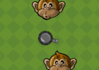
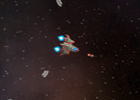
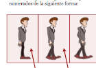

# Documentación

Un buen punto de inicio para comenzar a utilizar pilas es explorar el manual completo en español.

Este manual recorre toda la funcionalidad de pilas, y explica con ejemplos cómo utilizar cada parte del motor.

   <a href='https://pilas.readthedocs.org/es/latest/' class='button purple'>ver manual</a>
   <a href='http://media.readthedocs.org/pdf/pilas/latest/pilas.pdf' class='button blue'>descargar manual</a>
   <a href='api/index.html' class='button green'>ver referencia API</a>

## Tutoriales

También puedes seguir nuestros tutoriales paso a paso para aprender
sobre pilas haciendo juegos:

 

 
 

 

 <h4>Disparar a Monos</h4>

 
Una introducción a pilas-engine utilizando un juego de disparos.
 <ul style='margin-left: 1em; list-style-type: disc'>
  <li><a href="tutoriales/disparar_a_monos.pdf.pdf">Abrir PDF</a></li>
 </ul>
 

 

 
 

 

 <h4>Asteroides</h4>

 
Una guia para construir un juego como el original asteroides.
 <ul style='margin-left: 1em; list-style-type: disc'>
  <li><a href="tutoriales/Asteroides.pdf">Abrir PDF</a></li>
  <li><a href="tutoriales/recursos_asteroides.zip">Descargar recursos adicionales</a></li>
 </ul>
 

 

 
 

 

 <h4>Sprites y Física</h4>

 
Muestra los primeros pasos con actores, el motor de física y una comparativa entre pilas y pygame.
 <ul style='margin-left: 1em; list-style-type: disc'>
  <li><a href="tutoriales/mario.pdf">Abrir PDF</a></li>
  <li><a href="tutoriales/recursos_mario.zip">Descargar recursos adicionales</a></li>
 </ul>
 

 

 
 

 

 <h4>Grillas y Animación</h4>

 
Guia paso a paso para construir animaciones mediante grillas de gráficos.
 <ul style='margin-left: 1em; list-style-type: disc'>
  <li><a href="tutoriales/grillas.pdf">Abrir PDF</a></li>
  <li><a href="tutoriales/recursos_grillas.zip">Descargar recursos adicionales</a></li>
 </ul>
 

 

 
 

 

 <h4>Scrolling</h4>

 
Muestra cómo generar el efecto desplazamiento de múltiples capas.
 <ul style='margin-left: 1em; list-style-type: disc'>
  <li><a href="tutoriales/scrolling.pdf">Abrir PDF</a></li>
  <li><a href="tutoriales/recursos_scrolling.zip">Descargar recursos adicionales</a></li>
 </ul>
 

 

 
 

 

 <h4>Aceitunas vs Bombas</h4>

 
Un juego sencillo realizado paso a paso, desde el diseño hasta la publicación.

 <ul style='margin-left: 1em; list-style-type: disc'>
  <li><a href="aceitunas_vs_bombas_parte_1.html">Parte 1</a></li>
  <li><a href="aceitunas_vs_bombas_parte_2.html">Parte 2</a></li>
  <li>Parte 3 <small>(proximamente)</small></li>
 </ul>
 

