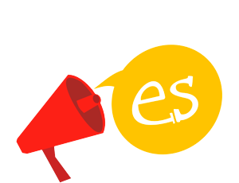
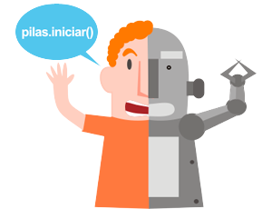

<h2 class="tagline">Crea videojuegos de manera didáctica y divertida.</h2>

    <a href='./descargas.html' class='button green'>descargar</a>
    <a href='./docs.html' class='button yellow'>ver la documentación</a>

  

       
       
Está dirigido a personas que comienzan a programar videojuegos y quieren lograr resultados sorprendentes y divertidos en poco tiempo.

  

  

       
       
Es multiplataforma: funciona en Windows, Gnu/Linux y Mac OS X. Cualquier persona puede utilizar el motor :).

  

  

       
       
Completamente en castellano: la documentación, los tutoriales y el código programado están en tu idioma.

  

  

       
       
Es interactiva: puedes programar mientras observas resultados. 

  

  

       
       
Incluye actores y ejemplos prediseñados: para que puedas comenzar a crear muchas variedades de juegos rápidamente.

  

  

       
       
Libre y gratuita: Es software libre bajo la LGPL, así que puedes copiar, modificar y distribuir el motor libremente.

  

